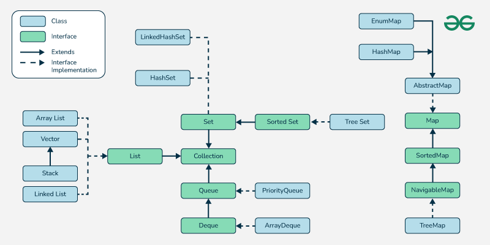

### Index
- [Testing Tools](#testing-tools)
- [Access Modifier](#access-modifier-in-java)
- [Marker Interfaces in JAVA](#marker-interfaces-in-java)
- [Order of Execution of Initialization block and constructor](#order-of-execution-of-initialization-block-and-constructor-in-java)
- [Object Class & it's list of method.](#object-class--its-list-of-methods)
- [Clone Method in JAVA](#clone-method-in-java)
- [Transient Fields in JAVA](#transient-fields-in-java)
- [Serialization/Deserialization in JAVA](#serializationdeserialization-in-java)
- [Copy Constructor in JAVA](#copy-constructor-in-java)
- [Atomic, Volatile & Synchronized](#atomic-volatile-and-synchronized)
- [Synchronized Block in JAVA](#synchronized-block-in-java)
- [Object Finalization in Java](#object-finalization-in-java)
- [StringBuffer Vs StringBuilder](#stringbuffer-vs-stringbuilder)
- [Comparison of some similar data structures in Java based on functionality, thread-safety, performance, and usage](#comparison-of-some-similar-data-structures-in-java-based-on-functionality-thread-safety-performance-and-usage)
- [Difference Between Checked Exceptions, Unchecked Exceptions, and Errors](#difference-between-checked-exceptions-unchecked-exceptions-and-errors)
- [Annotations in JAVA](#annotations-in-java)
- [Collections Hierarchy](#collection-hierarchy)
- [Making a class thread safe in java](#making-a-class-thread-safe-in-java)
- [Does Singleton Thread Safe in JAVA](#does-signleton-thread-safe-in-java)
- [@Service Vs @Component](#service-vs-component)
- [Immutable classes in java](#immutable-classes-in-java)
- [HashMap Internals in JAVA](#hashmap-internals-in-java)
- [Priority Queue Internals in JAVA](#priorityqueue-internals-in-java)
- [OOPs Principle](#oops-principles)
- [Difference Between Interface and Abstract Class in JAVA](#difference-between-interface-and-abstract-class-in-java)
- [Garbage Collection Algorithms](#garbage-collection-algorithms)
- [Design for Maintaining Transactional Consistency](#design-for-maintaining-the-transactional-consistency)
- [Design for Maintaining Transactional Consistency in Spring Boot](#design-for-maintaining-the-transactional-consistency-in-spring-boot)

## Testing Tools
Testing tools in java JUnit, Mockito, Spring test, JMeter, Selenium, SonarQube, Jenkins, Postman

Unit Testing  
Mocking:   
- Stub->Replicated the behaviour of API
- Mock->Validating the interaction or behaviour of components.


[back to top](#index)

## Access Modifier in JAVA
Access modifiers in Java are keywords that control the visibility and accessibility of classes, methods, constructors, and variables. They determine how other parts of the program can interact with a particular member or class.

| **Access Modifier** | **Within Class** | **Within Package** | **Outside Package (Child Class)** | **Outside Package** |
|----------------------|------------------|---------------------|------------------------------------|----------------------|
| **public**           | ✔               | ✔                   | ✔                                  | ✔                   |
| **protected**        | ✔               | ✔                   | ✔                                  | ✘                   |
| **default** *(no modifier)* | ✔               | ✔                   | ✘                                  | ✘                   |
| **private**          | ✔               | ✘                   | ✘                                  | ✘                   |


[back to top](#index)

## Marker Interfaces in JAVA
-   Cloneable
- Serializable

[back to top](#index)

## Order of execution of initialization block and constructor in java.

`Parent class static` → `Child class static` → `Parent class instance` → `Parent constructor` → `Child class instance` → `Child constructor`.

[back to top](#index)

## Object Class & it's list of methods.
The **`Object` class** in Java is the root of the class hierarchy. Every class in Java directly or indirectly inherits from the `Object` class, which means every class has access to its methods. Below is a detailed explanation of the methods provided by the `Object` class, with examples.

---

### **List of Java Object Class Methods**

#### 1. **`clone()`**
- **Description**: Creates and returns a copy of the object.
- **Access Modifier**: `protected` (needs to be overridden in the subclass and the class must implement `Cloneable` interface).

**Example**:
```java
class Person implements Cloneable {
    String name;

    Person(String name) {
        this.name = name;
    }

    @Override
    protected Object clone() throws CloneNotSupportedException {
        return super.clone();
    }

    public static void main(String[] args) throws CloneNotSupportedException {
        Person p1 = new Person("John");
        Person p2 = (Person) p1.clone();
        System.out.println(p2.name); // Output: John
    }
}
```

---

#### 2. **`equals()`**
- **Description**: Compares two objects for equality. By default, checks reference equality.
- **Override to compare contents**: Often overridden to check logical equality (e.g., for custom objects).

**Example**:
```java
class Person {
    String name;

    Person(String name) {
        this.name = name;
    }

    @Override
    public boolean equals(Object obj) {
        if (this == obj) return true;
        if (obj == null || getClass() != obj.getClass()) return false;
        Person person = (Person) obj;
        return name.equals(person.name);
    }

    public static void main(String[] args) {
        Person p1 = new Person("John");
        Person p2 = new Person("John");
        System.out.println(p1.equals(p2)); // Output: true
    }
}
```

---

#### 3. **`finalize()`**
- **Description**: Called by the garbage collector before an object is destroyed.
- **Usage**: Rarely used in modern Java due to inefficiency and unreliability.

**Example**:
```java
class Demo {
    @Override
    protected void finalize() throws Throwable {
        System.out.println("Object is being garbage collected.");
    }

    public static void main(String[] args) {
        Demo d = new Demo();
        d = null; // Mark object for garbage collection
        System.gc(); // Request JVM to perform garbage collection
    }
}
```

---

#### 4. **`getClass()`**
- **Description**: Returns the runtime class of the object.

**Example**:
```java
class Demo {
    public static void main(String[] args) {
        Demo obj = new Demo();
        System.out.println(obj.getClass().getName()); // Output: Demo
    }
}
```

---

#### 5. **`hashCode()`**
- **Description**: Returns a hash code value for the object.
- **Default Behavior**: Returns an integer derived from the memory address of the object.
- **Override it**: When overriding `equals()` for logical equality, override `hashCode()` for consistent behavior in hash-based collections.

**Example**:
```java
class Person {
    String name;

    Person(String name) {
        this.name = name;
    }

    @Override
    public int hashCode() {
        return name.hashCode();
    }

    public static void main(String[] args) {
        Person p1 = new Person("John");
        System.out.println(p1.hashCode()); // Output: Hash code based on name
    }
}
```

---

#### 6. **`notify()`**
- **Description**: Wakes up a single thread waiting on this object's monitor.
- **Usage**: Used in multithreading with synchronized blocks.

**Example**:
```java
class NotifyExample {
    public static void main(String[] args) {
        Object lock = new Object();

        Thread waitingThread = new Thread(() -> {
            synchronized (lock) {
                try {
                    System.out.println("Waiting...");
                    lock.wait();
                    System.out.println("Notified!");
                } catch (InterruptedException e) {
                    e.printStackTrace();
                }
            }
        });

        Thread notifyingThread = new Thread(() -> {
            synchronized (lock) {
                System.out.println("Notifying...");
                lock.notify();
            }
        });

        waitingThread.start();
        notifyingThread.start();
    }
}
```

---

#### 7. **`notifyAll()`**
- **Description**: Wakes up all threads waiting on this object's monitor.

**Example**:
```java
class NotifyAllExample {
    public static void main(String[] args) {
        Object lock = new Object();

        Thread waitingThread1 = new Thread(() -> {
            synchronized (lock) {
                try {
                    System.out.println("Thread 1 waiting...");
                    lock.wait();
                    System.out.println("Thread 1 notified!");
                } catch (InterruptedException e) {
                    e.printStackTrace();
                }
            }
        });

        Thread waitingThread2 = new Thread(() -> {
            synchronized (lock) {
                try {
                    System.out.println("Thread 2 waiting...");
                    lock.wait();
                    System.out.println("Thread 2 notified!");
                } catch (InterruptedException e) {
                    e.printStackTrace();
                }
            }
        });

        Thread notifyingThread = new Thread(() -> {
            synchronized (lock) {
                System.out.println("Notifying all...");
                lock.notifyAll();
            }
        });

        waitingThread1.start();
        waitingThread2.start();
        notifyingThread.start();
    }
}
```

---

#### 8. **`toString()`**
- **Description**: Returns a string representation of the object.
- **Default Behavior**: Class name + `@` + hexadecimal hash code.
- **Override it**: For meaningful string representation.

**Example**:
```java
class Person {
    String name;

    Person(String name) {
        this.name = name;
    }

    @Override
    public String toString() {
        return "Person{name='" + name + "'}";
    }

    public static void main(String[] args) {
        Person p = new Person("John");
        System.out.println(p); // Output: Person{name='John'}
    }
}
```

---

#### 9. **`wait()`**
- **Description**: Causes the current thread to wait until another thread invokes `notify()` or `notifyAll()` on the same object.
- **Usage**: Works with `synchronized` blocks to coordinate thread communication.

**Example**:
```java
class WaitExample {
    public static void main(String[] args) {
        Object lock = new Object();

        Thread waitingThread = new Thread(() -> {
            synchronized (lock) {
                try {
                    System.out.println("Waiting...");
                    lock.wait();
                    System.out.println("Notified!");
                } catch (InterruptedException e) {
                    e.printStackTrace();
                }
            }
        });

        Thread notifyingThread = new Thread(() -> {
            synchronized (lock) {
                System.out.println("Notifying...");
                lock.notify();
            }
        });

        waitingThread.start();
        notifyingThread.start();
    }
}
```

---

### **Summary**
| **Method**         | **Description**                                                                 |
|---------------------|---------------------------------------------------------------------------------|
| `clone()`           | Creates a copy of the object (needs `Cloneable` interface).                    |
| `equals()`          | Compares two objects for equality.                                             |
| `finalize()`        | Called by garbage collector before object destruction.                         |
| `getClass()`        | Returns the runtime class of the object.                                       |
| `hashCode()`        | Returns a hash code value for the object.                                      |
| `notify()`          | Wakes up a single thread waiting on the object's monitor.                      |
| `notifyAll()`       | Wakes up all threads waiting on the object's monitor.                          |
| `toString()`        | Returns a string representation of the object.                                 |
| `wait()`            | Causes the current thread to wait for a `notify()` or `notifyAll()` call.      |

These methods provide foundational behavior to all Java objects and enable critical features like object comparison, threading, and garbage collection.

[back to top](#index)

## **`clone()` Method in Java**

1. **Purpose**:
   - The `clone()` method creates a copy of an object. It performs a **shallow copy** by default and duplicates only the fields of the object, not the referenced objects.

2. **Requirements**:
   - The class must implement the **`Cloneable`** interface (a marker interface).
   - The `clone()` method must be **overridden** in the class.
   - If `Cloneable` is not implemented, `clone()` throws a **`CloneNotSupportedException`**.

3. **Key Characteristics**:
   - **Shallow Copy**: Copies fields of the object, but referenced objects are shared.
   - **Deep Copy**: Must be implemented manually by cloning all referenced objects within the `clone()` method.

4. **Usage**:
   - Use `clone()` when you need to duplicate an object quickly.
   - Avoid using `clone()` for objects with complex relationships unless deep copy is explicitly handled.

5. **Examples**:
   - **Shallow Copy**: Creates a duplicate with shared references to mutable objects.
   - **Deep Copy**: Requires overriding the `clone()` method to clone referenced objects.

6. **Advantages**:
   - Provides a quick and efficient way to copy objects.
   - Reduces repetitive code for copying fields manually.

7. **Disadvantages**:
   - Can lead to shared references (shallow copy), causing unintended side effects.
   - Complex to handle deep copies properly.
   - Alternatives like copy constructors or serialization are often preferred.

8. **Alternatives**:
   - **Copy Constructor**: A constructor that duplicates the object manually.
   - **Serialization/Deserialization**: Serializes the object to a stream and deserializes it for a deep copy.

**When to Use**:
- Use `clone()` for simple objects where shallow copying suffices or performance is critical. For more flexibility and maintainability, consider alternatives like copy constructors or factory methods.

[back to top](#index)

## **Transient Fields in Java**

- **Definition**: Transient fields in Java are not included in the serialized form of an object. They are marked using the `transient` keyword.

- **Purpose**: Used to exclude fields from serialization, typically for:
  - Sensitive data (e.g., passwords).
  - Temporary or derived data.
  - Non-serializable objects.

- **Default Behavior**:
  - During deserialization, transient fields are initialized to their **default values**:
    - `0` for numeric types, `false` for `boolean`, and `null` for objects.

- **Reinitialization**:
  - Transient fields can be reinitialized after deserialization by overriding the `readObject()` method.

- **Example**:
```java
class User implements Serializable {
    String username;
    transient String password; // Excluded from serialization

    User(String username, String password) {
        this.username = username;
        this.password = password;
    }
}
```

**During Serialization**:
- `username` is serialized.
- `password` is ignored and restored as `null` during deserialization. 

**Advantages**:
1. Security: Prevents sensitive data from being serialized.
2. Flexibility: Avoids errors with non-serializable fields.
3. Efficiency: Reduces serialized object size.

[back to top](#index)

## **Serialization/Deserialization in Java**

- **Serialization**: Converts an object into a **byte stream** for storage (e.g., file) or transmission (e.g., over a network). Captures the object's state and class metadata.

- **Deserialization**: Reconstructs the object from the **byte stream**, restoring its state.

---

### **Key Points**

1. **Serializable Interface**:
   - The class **must implement the `Serializable` interface** to support serialization.
   - If a referenced object is not serializable, serialization will fail with a `NotSerializableException`.

2. **What is Serialized?**
   - Class metadata (class name, `serialVersionUID`, hierarchy).
   - All **non-transient** and **non-static** fields.
   - References to other objects, provided they are also serializable.

3. **Transient Fields**:
   - Fields marked as `transient` are **not serialized** and are initialized to their **default values** upon deserialization.

4. **Process**:
   - **Serialization**: Use `ObjectOutputStream` to write objects to a file or stream.
   - **Deserialization**: Use `ObjectInputStream` to read objects back into memory.

---

### **Code Example**

**Serialization**:
```java
try (FileOutputStream fos = new FileOutputStream("object.ser");
     ObjectOutputStream oos = new ObjectOutputStream(fos)) {
    oos.writeObject(object); // Serialize the object
}
```

**Deserialization**:
```java
try (FileInputStream fis = new FileInputStream("object.ser");
     ObjectInputStream ois = new ObjectInputStream(fis)) {
    Object obj = ois.readObject(); // Deserialize the object
}
```

---

### **Advantages**:
- Provides easy persistence of object states.
- Handles object graphs (nested references) automatically.
- Enables transmission of objects over a network.

### **Disadvantages**:
- All classes involved must implement `Serializable`.
- Performance overhead due to I/O operations.
- Transient fields and non-serializable objects require additional handling.

---

This mechanism is best suited for simple object storage and transmission scenarios. For more complex use cases, alternatives like JSON or XML serialization (e.g., using libraries like Jackson) are often preferred.

[back to top](#index)

## **Copy Constructor in Java**

A **copy constructor** in Java is used to create a new object as a copy of an existing object. It takes an object of the same class as a parameter and duplicates its content. 

---

### **Syntax**
```java
public ClassName(ClassName other) {
    // Copy fields from `other` to the new object
    this.field1 = other.field1;
    this.field2 = other.field2;
}
```

---

### **Key Concepts**

1. **Shallow Copy**:
   - Copies primitive fields and object references. For reference fields, only the reference is copied, not the actual object.

2. **Deep Copy**:
   - Copies primitive fields and creates new instances for reference fields, ensuring complete independence from the original object.

---

### **Example with Reference Field**

```java
class Address {
    String city;

    // Constructor
    public Address(String city) {
        this.city = city;
    }

    // Copy Constructor for Address
    public Address(Address other) {
        this.city = other.city;
    }
}

class Person {
    String name;
    Address address;

    // Constructor
    public Person(String name, Address address) {
        this.name = name;
        this.address = address;
    }

    // Copy Constructor for Person
    public Person(Person other) {
        this.name = other.name; // Copy primitive field
        this.address = new Address(other.address); // Deep copy reference field
    }

    public static void main(String[] args) {
        Address address1 = new Address("New York");
        Person original = new Person("Alice", address1);

        // Create a copy using the copy constructor
        Person copy = new Person(original);

        // Modify original reference object
        address1.city = "San Francisco";

        System.out.println("Original City: " + original.address.city); // San Francisco
        System.out.println("Copy City: " + copy.address.city); // New York
    }
}
```

---

### **Output**
```
Original City: San Francisco
Copy City: New York
```

---

### **Advantages of Copy Constructor**
1. **Customization**: Allows control over how objects are copied.
2. **Deep Copy**: Enables creating completely independent objects by duplicating referenced objects.

---

### **Usage Tips**
- Use **shallow copy** if the referenced object doesn't require duplication.
- Use **deep copy** if the referenced object should be independent of the original.

[back to top](#index)

## **Atomic, Volatile, and Synchronized**

---

#### **1. `Atomic`**
- **Purpose**: Provides thread-safe, atomic operations on variables without explicit locking.
- **Key Features**:
  - Guarantees **atomicity** for operations (e.g., increment, compare-and-set).
  - Implicitly ensures **visibility** of updates to all threads.
- **How It Works**:
  - Uses **Compare-And-Swap (CAS)** internally for non-blocking, lock-free updates.
- **Use Cases**:
  - Counters, accumulators, or atomic updates in high-concurrency scenarios.
- **Examples**:
  - `AtomicInteger`, `AtomicLong`, `AtomicReference`.
  
Example of AtomicInteger:  
```java
import java.util.concurrent.atomic.AtomicInteger;

public class AtomicExample {
    public static void main(String[] args) {
        // Create an AtomicInteger with an initial value of 0
        AtomicInteger atomicCounter = new AtomicInteger(0);

        // Atomically increment the value and print it
        System.out.println("Initial Value: " + atomicCounter.get());
        atomicCounter.incrementAndGet(); // Increment and get the new value
        System.out.println("After Increment: " + atomicCounter.get());

        // Atomically set a new value
        atomicCounter.set(100);
        System.out.println("After Set: " + atomicCounter.get());

        // Atomically update value if it matches the expected value
        boolean success = atomicCounter.compareAndSet(100, 200);
        System.out.println("Compare and Set Success: " + success);
        System.out.println("After Compare and Set: " + atomicCounter.get());

        // Atomically add a value and return the result
        int updatedValue = atomicCounter.addAndGet(50);
        System.out.println("After Add and Get: " + updatedValue);
    }
}
```
---

#### **2. `Volatile`**
- **Purpose**: Ensures **visibility** of variable updates across threads.
- **Key Features**:
  - Threads always read the latest value of a volatile variable from main memory.
  - Does **not guarantee atomicity** for compound operations (e.g., `count++`).
- **How It Works**:
  - Prevents threads from caching the variable locally.
- **Use Cases**:
  - Simple flags, status variables, or single-read/write scenarios.
- **Example**:
  - A volatile `boolean` flag to stop a thread.
```java
class VolatileExample {
    // Declaring the variable as volatile ensures visibility across threads
    private static volatile boolean flag = false;

    public static void main(String[] args) throws InterruptedException {
        // Thread 1: Sets the flag to true after 2 seconds
        Thread writerThread = new Thread(() -> {
            try {
                Thread.sleep(2000); // Simulating some work
                flag = true;
                System.out.println("Flag is set to true");
            } catch (InterruptedException e) {
                Thread.currentThread().interrupt();
            }
        });

        // Thread 2: Keeps checking the flag value and prints a message when it's true
        Thread readerThread = new Thread(() -> {
            while (!flag) {
                // Busy-waiting until flag becomes true
            }
            System.out.println("Flag is true, Reader Thread Exiting.");
        });

        // Start both threads
        writerThread.start();
        readerThread.start();

        // Wait for threads to finish
        writerThread.join();
        readerThread.join();
    }
}
```
---

#### **3. `Synchronized`**
- **Purpose**: Provides **mutual exclusion** and guarantees both **atomicity** and **visibility**.
- **Key Features**:
  - Ensures only one thread can execute a synchronized block/method at a time.
  - Makes updates visible to other threads after the lock is released.
- **How It Works**:
  - Uses **intrinsic locks (monitor locks)**.
  - Threads attempting to acquire a lock are blocked if another thread holds it.
- **Use Cases**:
  - Protecting critical sections or shared resources in multi-step operations.
- **Example**:
  - A synchronized method to increment a shared counter.
```java
class Counter {
    private int count = 0;

    // Synchronized method
    public synchronized void increment() {
        count++;
    }

    public int getCount() {
        return count;
    }
}
```
---

### **Comparison**

| **Feature**            | **Atomic**                      | **Volatile**                    | **Synchronized**                 |
|-------------------------|----------------------------------|----------------------------------|----------------------------------|
| **Primary Purpose**     | Atomic operations on variables. | Visibility of variable updates.  | Mutual exclusion and visibility. |
| **Thread-Safety**       | Ensures atomicity and visibility.| Guarantees visibility only.      | Guarantees atomicity and visibility. |
| **Blocking**            | Non-blocking (lock-free).       | Non-blocking.                   | Blocking (threads wait for lock).|
| **Use Cases**           | Counters, accumulators.         | Flags, status indicators.        | Protecting critical sections.    |

---

### **When to Use**
1. **Atomic**: When you need atomicity and performance for simple operations (e.g., counters).
2. **Volatile**: When you only need visibility, not atomicity (e.g., a stop flag).
3. **Synchronized**: When you need both atomicity and visibility for complex, multi-step operations.

[back to top](#index)

## **Synchronized Block in Java**

A **synchronized block** is used to limit the scope of synchronization to specific parts of a method, ensuring that only one thread can execute a critical section of code at a time. It is more efficient than synchronizing the entire method because it only locks the necessary code, reducing unnecessary blocking.

#### **Syntax**:
```java
synchronized (object) {
    // Critical section
}
```
- **object**: The object being locked (e.g., `this` or any other object reference).

#### **Use Case**:
Used when multiple threads access shared resources (like variables) and you want to ensure thread safety by locking only the critical section (e.g., data modification) without blocking other code in the method.

#### **Example**:
```java
class BankAccount {
    private double balance;

    public void deposit(double amount) {
        synchronized (this) {
            balance += amount;
        }
    }
}
```

#### **Advantages**:
- **Performance**: Locks only the critical section, improving efficiency.
- **Granularity**: Provides more fine-grained control compared to synchronizing an entire method.

### **Conclusion**:
A synchronized block in Java ensures thread safety for critical code sections, minimizing blocking and improving performance.

[back to top](#index)  

## **Object Finalization in Java**

- **Definition**: Finalization is the process where the **`finalize()`** method is called by the **garbage collector** before reclaiming an object's memory.
- **Method**: 
  ```java
  protected void finalize() throws Throwable
  ```
- **Purpose**: Used to perform clean-up tasks like releasing resources (e.g., closing files, freeing memory).

---

### **Key Points**:
1. **When is it Called?**
   - Called by the garbage collector when the object becomes unreachable.
   - No guarantee on the timing or if it will be called at all.

2. **Limitations**:
   - Unpredictable and unreliable.
   - Slows down garbage collection.
   - Called only once per object.

3. **Modern Status**:
   - **Deprecated** as of Java 9 due to inefficiency and better alternatives.

4. **Alternatives**:
   - **`try-with-resources`**: Use for managing files, streams, and other resources.
   - **Explicit Cleanup**: Provide methods like `close()` or `dispose()` for resource management.

---

**Example**:
```java
@Override
protected void finalize() throws Throwable {
    System.out.println("Finalize called for cleanup.");
}
```

**Preferred Alternative**:
```java
try (FileInputStream fis = new FileInputStream("file.txt")) {
    // Process file
} catch (IOException e) {
    e.printStackTrace();
}
``` 

**Summary**: Avoid using `finalize()`; rely on **`try-with-resources`** or manual clean-up methods for resource management.

[back to top](#index)

## **StringBuffer vs StringBuilder**

`StringBuffer` and `StringBuilder` are classes in Java used to manipulate strings dynamically. Both are mutable, meaning their content can be modified without creating a new object. However, they differ primarily in terms of **thread safety** and **performance**.

---

### **Key Differences**

| **Feature**              | **StringBuffer**                                       | **StringBuilder**                                   |
|--------------------------|-------------------------------------------------------|---------------------------------------------------|
| **Thread Safety**         | Thread-safe: Methods are synchronized.               | Not thread-safe: No synchronization.             |
| **Performance**           | Slower due to synchronization overhead.              | Faster as it doesn’t synchronize methods.        |
| **Usage in Multithreading**| Suitable for multi-threaded environments.            | Suitable for single-threaded environments.       |
| **Introduced In**         | Java 1.0                                             | Java 5                                           |

---

### **Similarities**
1. **Mutability**:
   - Both classes allow modification of strings (e.g., append, insert, delete) without creating new objects.
   
2. **Methods**:
   - Both share similar methods like `append()`, `insert()`, `delete()`, `reverse()`, etc.

3. **Underlying Mechanism**:
   - Both use a **mutable character array** internally.

---

### **Example: StringBuffer**
```java
public class StringBufferExample {
    public static void main(String[] args) {
        StringBuffer sb = new StringBuffer("Hello");
        sb.append(" World"); // Thread-safe modification
        System.out.println(sb); // Output: Hello World
    }
}
```

### **Example: StringBuilder**
```java
public class StringBuilderExample {
    public static void main(String[] args) {
        StringBuilder sb = new StringBuilder("Hello");
        sb.append(" World"); // Faster but not thread-safe
        System.out.println(sb); // Output: Hello World
    }
}
```

---

### **When to Use**
1. **Use `StringBuffer`**:
   - In multi-threaded applications where multiple threads modify the same string object.
   - Example: Logging systems in a concurrent environment.

2. **Use `StringBuilder`**:
   - In single-threaded applications or when thread safety is not required.
   - Example: String manipulations in performance-critical tasks.

---

### **Summary**
- **StringBuffer**: Thread-safe but slower due to synchronization.
- **StringBuilder**: Faster but not thread-safe. Preferable in single-threaded scenarios.

[back to top](#index)

## Comparison of some **similar data structures** in Java based on functionality, thread-safety, performance, and usage:

---

### **1. `ArrayList` vs `LinkedList`**
| **Feature**          | **ArrayList**                             | **LinkedList**                            |
|-----------------------|-------------------------------------------|-------------------------------------------|
| **Underlying Data Structure** | Dynamic array                          | Doubly linked list                        |
| **Access Time**       | Fast (`O(1)` for index-based access)      | Slow (`O(n)` for index-based access)      |
| **Insertion/Deletion**| Slow (`O(n)` for shifting elements)       | Fast (`O(1)` at the beginning/end)        |
| **Memory Usage**      | Less memory (stores only data).           | More memory (stores data and pointers).   |
| **Thread Safety**     | Not thread-safe.                         | Not thread-safe.                          |
| **Use Case**          | Random access of elements.               | Frequent insertions and deletions.        |

---

### **2. `HashMap` vs `Hashtable`**
| **Feature**           | **HashMap**                              | **Hashtable**                             |
|-----------------------|-------------------------------------------|-------------------------------------------|
| **Thread Safety**     | Not thread-safe.                         | Thread-safe (synchronized methods).       |
| **Null Keys/Values**  | Allows one `null` key and multiple `null` values. | Does not allow `null` keys or values.     |
| **Performance**       | Faster (no synchronization overhead).    | Slower due to synchronization.            |
| **Introduced In**     | Java 1.2                                 | Java 1.0                                  |
| **Use Case**          | Non-concurrent, high-performance scenarios. | Concurrent access in legacy systems.      |

---

### **3. `HashMap` vs `ConcurrentHashMap`**
| **Feature**           | **HashMap**                              | **ConcurrentHashMap**                     |
|-----------------------|-------------------------------------------|-------------------------------------------|
| **Thread Safety**     | Not thread-safe.                         | Thread-safe (uses segment locking).       |
| **Concurrency Level** | No support for concurrency.              | Allows multiple threads to read/write simultaneously. |
| **Null Keys/Values**  | Allows one `null` key and multiple `null` values. | Does not allow `null` keys or values.     |
| **Performance**       | Faster in single-threaded environments.  | Faster in multi-threaded environments.    |
| **Use Case**          | Single-threaded applications.            | Concurrent, thread-safe access to maps.   |

---

### **4. `Vector` vs `ArrayList`**
| **Feature**           | **Vector**                               | **ArrayList**                             |
|-----------------------|-------------------------------------------|-------------------------------------------|
| **Thread Safety**     | Thread-safe (synchronized methods).       | Not thread-safe.                          |
| **Performance**       | Slower due to synchronization overhead.   | Faster in non-threaded environments.      |
| **Growth Mechanism**  | Doubles its size when needed.             | Increases by 50% when needed.             |
| **Legacy/Modern**     | Legacy class (Java 1.0).                 | Modern class (Java 1.2, part of `Collection` framework). |
| **Use Case**          | Multi-threaded environments (legacy systems). | Single-threaded environments.            |

---

### **5. `HashSet` vs `TreeSet` vs `LinkedHashSet`**
| **Feature**           | **HashSet**                              | **TreeSet**                               | **LinkedHashSet**                         |
|-----------------------|-------------------------------------------|-------------------------------------------|-------------------------------------------|
| **Underlying Data Structure** | Hash table.                          | Red-Black tree.                           | Hash table + Linked list.                 |
| **Ordering**          | No guaranteed order.                     | Sorted order (natural or comparator-defined). | Insertion order is maintained.           |
| **Null Elements**     | Allows one `null` element.               | Does not allow `null` elements.           | Allows one `null` element.               |
| **Performance**       | Fast (`O(1)` for add, remove, contains).  | Slower (`O(log n)` for add, remove, contains). | Moderate (`O(1)` with insertion order). |
| **Use Case**          | High-performance lookups.                | Sorted data requirements.                 | Preserving insertion order.               |

---

### **6. `Stack` vs `Deque`**
| **Feature**           | **Stack**                                | **Deque**                                 |
|-----------------------|-------------------------------------------|-------------------------------------------|
| **Thread Safety**     | Thread-safe (legacy, synchronized methods).| Not thread-safe (unless `ConcurrentLinkedDeque` is used). |
| **Performance**       | Slower due to synchronization.           | Faster in non-threaded environments.      |
| **Flexibility**       | LIFO (Last-In-First-Out) operations only. | Supports both LIFO and FIFO (First-In-First-Out). |
| **Modern Equivalent** | Legacy class.                            | Preferred for stack and queue operations. |
| **Use Case**          | Use in legacy codebases.                 | Use in modern applications.               |

---

### **7. `TreeMap` vs `HashMap`**
| **Feature**           | **HashMap**                              | **TreeMap**                               |
|-----------------------|-------------------------------------------|-------------------------------------------|
| **Ordering**          | No specific order.                       | Sorted order (natural or comparator-defined). |
| **Null Keys**         | Allows one `null` key.                   | Does not allow `null` keys.               |
| **Performance**       | Fast (`O(1)` for get/put).               | Slower (`O(log n)` for get/put).          |
| **Use Case**          | High-performance key-value storage.      | Sorted key-value storage.                 |

---

### **8. `PriorityQueue` vs `Deque`**
| **Feature**           | **PriorityQueue**                        | **Deque**                                 |
|-----------------------|-------------------------------------------|-------------------------------------------|
| **Purpose**           | Retrieves elements based on priority.    | Double-ended operations (add/remove from both ends). |
| **Ordering**          | Maintains a natural or comparator-defined order. | No specific order.                       |
| **Null Elements**     | Does not allow `null` elements.           | Allows `null` elements.                  |
| **Use Case**          | Scheduling tasks by priority.            | Stacks or queues with flexible operations.|

---

### **Summary**
- Choose based on requirements like **thread safety** (e.g., `Vector` vs `ArrayList`), **ordering** (e.g., `TreeSet` vs `HashSet`), and **performance** (e.g., `HashMap` vs `TreeMap`).
- Modern data structures (`ArrayList`, `Deque`, `ConcurrentHashMap`) are preferred over legacy ones (`Vector`, `Hashtable`, `Stack`).

[back to top](#index)
## **Difference Between Checked Exceptions, Unchecked Exceptions, and Errors**

---

| **Aspect**               | **Checked Exceptions**                        | **Unchecked Exceptions**                       | **Errors**                                     |
|--------------------------|-----------------------------------------------|-----------------------------------------------|-----------------------------------------------|
| **Definition**            | Exceptions that must be handled at compile time (checked by the compiler). | Exceptions that occur at runtime and are not checked at compile time. | Critical issues related to the JVM or environment, not recoverable in most cases. |
| **Examples**             | `IOException`, `SQLException`, `FileNotFoundException`, `ClassNotFoundException`. | `NullPointerException`, `ArrayIndexOutOfBoundsException`, `ArithmeticException`. | `OutOfMemoryError`, `StackOverflowError`, `NoClassDefFoundError`. |
| **Compile-Time Handling**| Must be declared in the method signature using `throws` or handled with a `try-catch` block. | Not required to be declared or handled explicitly. | Cannot be handled programmatically in most cases. |
| **Cause**                | Typically caused by external factors like file handling, database access, or network issues. | Typically caused by logical errors or bugs in the program. | Critical system-level problems (e.g., resource exhaustion, JVM issues). |
| **Recovery**             | Can often be recovered by handling (e.g., retrying the operation, providing default values). | Can sometimes be recovered by fixing logical issues in the code. | Rarely recoverable; typically requires restarting the application or JVM. |
| **Hierarchy**            | Subclasses of `Exception` (except `RuntimeException`). | Subclasses of `RuntimeException`.             | Subclasses of `Error`.                        |
| **Handling Requirement**| Mandatory to handle or declare.               | Optional to handle.                           | Should not be handled explicitly.             |
| **Use Case**             | For predictable issues that the program can potentially recover from. | For programming errors or bugs.               | For fatal problems that are beyond application control. |

---

### **Detailed Examples**

#### **Checked Exception**
```java
import java.io.*;

public class CheckedExceptionExample {
    public static void main(String[] args) {
        try {
            FileReader file = new FileReader("nonexistentfile.txt"); // FileNotFoundException
        } catch (FileNotFoundException e) {
            System.out.println("File not found!");
        }
    }
}
```
- **Explanation**:
  - The `FileNotFoundException` is a checked exception.
  - The compiler forces you to either handle it with a `try-catch` block or declare it with `throws`.

---

#### **Unchecked Exception**
```java
public class UncheckedExceptionExample {
    public static void main(String[] args) {
        int[] arr = {1, 2, 3};
        System.out.println(arr[3]); // ArrayIndexOutOfBoundsException
    }
}
```
- **Explanation**:
  - The `ArrayIndexOutOfBoundsException` is an unchecked exception.
  - It is not checked by the compiler, and the program crashes if not handled.

---

#### **Error**
```java
public class ErrorExample {
    public static void main(String[] args) {
        main(args); // Infinite recursion causes StackOverflowError
    }
}
```
- **Explanation**:
  - The `StackOverflowError` occurs when the call stack is exhausted.
  - Errors like these are not meant to be handled programmatically.

---

### **When to Use**

| **Scenario**                      | **Use Case**                                                                 |
|------------------------------------|------------------------------------------------------------------------------|
| **Checked Exceptions**             | For external resources (e.g., file handling, database access) that might fail. |
| **Unchecked Exceptions**           | For programming bugs (e.g., null pointer access, invalid array indexing).    |
| **Errors**                         | For critical system issues like resource exhaustion, JVM issues, etc.         |

---

### **Summary**
1. **Checked Exceptions**:
   - Must be handled at compile time.
   - Used for predictable issues like I/O or database failures.

2. **Unchecked Exceptions**:
   - Occur due to programming logic errors.
   - Checked at runtime, optional to handle.

3. **Errors**:
   - Represent critical problems beyond the application's control.
   - Usually cannot be recovered programmatically.

[back to top](#index)

## **Annotations in Java**

Annotations are **metadata** in Java that provide additional information about the code without affecting its execution. They are used for **compiler instructions**, **runtime configurations**, and **code generation**.

---

### **Key Points**
1. **Syntax**: Annotations start with `@` (e.g., `@Override`).
2. **Placement**: Can be applied to classes, methods, fields, parameters, etc.
3. **Categories**:
   - **Built-in Annotations**:
     - `@Override`: Ensures method overrides a superclass method.
     - `@Deprecated`: Marks code as outdated.
     - `@SuppressWarnings`: Suppresses compiler warnings.
   - **Runtime Annotations**:
     - Used by frameworks (e.g., `@Entity`, `@Autowired`) and accessed via reflection.
   - **Custom Annotations**:
     - Define your own with `@interface`, `@Retention`, and `@Target`.

---

### **Typical Use Cases**
1. **Compile-Time Checks**:
   - Example: `@Override` ensures a method correctly overrides.
2. **Runtime Configurations**:
   - Frameworks like Spring (`@Autowired`), Hibernate (`@Entity`), JUnit (`@Test`).
3. **Dependency Injection**:
   - Example: Spring’s `@Autowired` for injecting dependencies.
4. **Code Generation**:
   - Example: Lombok’s `@Getter` and `@Setter` for reducing boilerplate code.
5. **Testing**:
   - Example: JUnit’s `@Test` marks test methods.

---

### **Example**
```java
@Override
public String toString() {
    return "Example";
}

@CustomAnnotation("Custom Value")
public void myMethod() {
    System.out.println("Custom annotation applied.");
}
```

Annotations improve code clarity, reduce boilerplate, and simplify configuration, making them essential in modern Java development.

[back to top](#index)

## Collection Hierarchy



[back to top](#index)

## **Making a Class Thread-Safe in Java**

A **thread-safe class** ensures that its methods or operations behave correctly when accessed by multiple threads concurrently. Below are various techniques to achieve thread safety in Java:

-   Use Synchronized Keyword.
-   Use volatile Keyword.
-   Use Atomic Classes.
-   Use java.util.concurrent.locks.
-   Use immutable objects.
-   Use Thread-safe Collections.
-   Use Thread local variables.

---

### **1. Use `synchronized` Keyword**
- Synchronize critical sections of code to allow only one thread to access them at a time.

**Example:**
```java
public class Counter {
    private int count = 0;

    public synchronized void increment() {
        count++;
    }

    public synchronized int getCount() {
        return count;
    }
}
```

---

### **2. Use `volatile` Keyword**
- Ensure visibility of changes to variables across threads.
- Suitable for simple read/write operations.

**Example:**
```java
public class SharedFlag {
    private volatile boolean flag = true;

    public boolean isFlag() {
        return flag;
    }

    public void setFlag(boolean flag) {
        this.flag = flag;
    }
}
```

---

### **3. Use Atomic Classes (from `java.util.concurrent.atomic`)**
- For atomic operations without explicit synchronization.

**Example:**
```java
import java.util.concurrent.atomic.AtomicInteger;

public class Counter {
    private AtomicInteger count = new AtomicInteger(0);

    public void increment() {
        count.incrementAndGet();
    }

    public int getCount() {
        return count.get();
    }
}
```

---

### **4. Use `java.util.concurrent.locks`**
- Provides more control over locking mechanisms.

**Example:**
```java
import java.util.concurrent.locks.ReentrantLock;

public class Counter {
    private int count = 0;
    private final ReentrantLock lock = new ReentrantLock();

    public void increment() {
        lock.lock();
        try {
            count++;
        } finally {
            lock.unlock();
        }
    }

    public int getCount() {
        lock.lock();
        try {
            return count;
        } finally {
            lock.unlock();
        }
    }
}
```

---

### **5. Use Immutable Objects**
- Make all fields `final` and prevent modifications to the object's state.

**Example:**
```java
public final class ImmutablePoint {
    private final int x;
    private final int y;

    public ImmutablePoint(int x, int y) {
        this.x = x;
        this.y = y;
    }

    public int getX() {
        return x;
    }

    public int getY() {
        return y;
    }
}
```

---

### **6. Use Thread-Safe Collections**
- Replace standard collections with thread-safe alternatives like:
  - `Collections.synchronizedList()`
  - `CopyOnWriteArrayList`
  - `ConcurrentHashMap`

**Example:**
```java
import java.util.concurrent.CopyOnWriteArrayList;

public class ThreadSafeList {
    private final CopyOnWriteArrayList<String> list = new CopyOnWriteArrayList<>();

    public void add(String item) {
        list.add(item);
    }

    public String get(int index) {
        return list.get(index);
    }
}
```

---

### **7. Thread-Local Variables**
- Each thread has its own isolated copy of the variable.

**Example:**
```java
public class ThreadSafeExample {
    private static ThreadLocal<Integer> threadLocal = ThreadLocal.withInitial(() -> 0);

    public int getValue() {
        return threadLocal.get();
    }

    public void setValue(int value) {
        threadLocal.set(value);
    }
}
```

---

### **Choosing the Right Method**
- **Simple Cases:** Use `synchronized` or `volatile`.
- **High Performance:** Use `Atomic` classes or `Locks`.
- **Collections:** Use thread-safe collections.
- **Immutability:** Use immutable objects for read-only data.
- **Per-Thread State:** Use `ThreadLocal`.

Each approach has trade-offs in complexity, performance, and suitability depending on the use case.

[back to top](#index)


## Does signleton Thread Safe in JAVA?
A **singleton class** is not inherently thread-safe in Java. If multiple threads attempt to create an instance simultaneously, it may result in multiple instances being created. To ensure thread safety, the implementation must be explicitly designed to handle concurrency.


- `Eager Initialization`: The instance is created when the class is loaded.
- `Synchronized Method`: Ensure only one thread can access the method at a time.
- `Double Checking Locking`: Use volitile and Synchronized both.
- `Bill Pugh Singleton`: Relies on JAVA loader.

---

### **Thread-Safe Singleton Implementations**

#### **1. Eager Initialization (Thread-Safe)**
- The instance is created when the class is loaded.
- Thread-safe because the class loader ensures that only one instance is created.

**Example:**
```java
public class Singleton {
    private static final Singleton INSTANCE = new Singleton();

    private Singleton() {
        // private constructor
    }

    public static Singleton getInstance() {
        return INSTANCE;
    }
}
```

---

#### **2. Synchronized Method**
- Uses `synchronized` to ensure only one thread can access the method at a time.
- Slower due to synchronization overhead.

**Example:**
```java
public class Singleton {
    private static Singleton instance;

    private Singleton() {
        // private constructor
    }

    public static synchronized Singleton getInstance() {
        if (instance == null) {
            instance = new Singleton();
        }
        return instance;
    }
}
```

---

#### **3. Double-Checked Locking (Lazy Initialization)**
- Improves performance by reducing synchronization overhead.
- Uses `volatile` to ensure proper visibility of the instance across threads.

**Example:**
```java
public class Singleton {
    private static volatile Singleton instance;

    private Singleton() {
        // private constructor
    }

    public static Singleton getInstance() {
        if (instance == null) {
            synchronized (Singleton.class) {
                if (instance == null) {
                    instance = new Singleton();
                }
            }
        }
        return instance;
    }
}
```

---

#### **4. Bill Pugh Singleton (Best Practice)**
- Relies on the Java class loader to ensure thread safety.
- Instance is created only when the `getInstance()` method is called.

**Example:**
```java
public class Singleton {
    private Singleton() {
        // private constructor
    }

    private static class SingletonHelper {
        private static final Singleton INSTANCE = new Singleton();
    }

    public static Singleton getInstance() {
        return SingletonHelper.INSTANCE;
    }
}
```

---

### **Which Implementation to Use?**
- **Eager Initialization**: If the singleton is lightweight and will always be used.
- **Double-Checked Locking**: For a balance of performance and lazy initialization.
- **Bill Pugh Singleton**: Best practice for lazy initialization and thread safety without synchronization overhead. 

By using these approaches, you can make a singleton class thread-safe.

[back to top](#index)

## **Singleton Vs Static Class in JAVA**  
- **Static Classes** are used for utility functions and are stateless.  
- **Singleton Classes** ensure a single instance exists and allow state management, flexibility, and testability.  
- Singleton is better for scenarios needing inheritance, dependency injection, or polymorphism.

---

### **Key Differences Between Singleton and Static Classes**

| **Aspect**              | **Singleton Class**                                  | **Static Class**                          |
|-------------------------|------------------------------------------------------|-------------------------------------------|
| **Instance**            | Single instance, created when needed.                | No instance, accessed via class name.     |
| **Inheritance**         | Supports inheritance and interfaces.                 | No inheritance or polymorphism.           |
| **State**               | Can maintain state using instance variables.         | Stateless (no instance-level variables).  |
| **Lazy Initialization** | Instance created lazily if needed.                   | Always loaded when the class is accessed. |
| **Testability**         | Easier to mock or replace in tests.                  | Hard to mock or replace.                  |
| **Use Case**            | Complex objects requiring state or polymorphism.     | Utility methods with no state or side effects. |


[back to top](#index)


## @Service Vs @Component

@Service: A specialization of @Component for service layer classes, indicating business logic.  
@Component: General-purpose annotation for any Spring-managed bean.  

Both perform the same function, but `@Service provides semantic clarity.`

[back to top](#index)  

## **Immutable Classes in Java**

An **immutable class** is a class whose **state** (i.e., its fields) cannot be **modified** after it is created.

### **Key Characteristics of Immutable Classes**:
1. **Final Class**: The class is declared `final` to prevent subclassing.
2. **Final Fields**: All fields are declared `final` so they can be assigned only once.
3. **No Setter Methods**: No methods are provided to modify the object's state.
4. **Proper Initialization**: Fields are initialized via the constructor and cannot be changed afterward.
5. **Defensive Copies**: If the class contains fields that refer to mutable objects, those fields are **copied** to ensure the original object remains unmodified.

---

### **Why Use Immutable Classes?**
1. **Thread Safety**: Immutable objects are inherently **thread-safe** since their state cannot be changed after creation, making them ideal for concurrent programming.
2. **Simplicity**: They are easier to reason about because their state is fixed and predictable.
3. **Security**: Immutable objects can't be altered, which makes them safer for use in security-sensitive contexts.
4. **Caching**: Since their state doesn't change, immutable objects can be safely cached without risk of data inconsistency.

### **Example of an Immutable Class**:
```java
public final class Person {
    private final String name;
    private final int age;

    public Person(String name, int age) {
        this.name = name;
        this.age = age;
    }

    public String getName() {
        return name;
    }

    public int getAge() {
        return age;
    }
}
```

In this example, `Person` is immutable because:
- It cannot be subclassed (`final class`).
- Fields are `final` and can only be set in the constructor.
- There are no setter methods.

[back to top](#index)  

Thread Safe
-   ConcurrentHashMap
-   HashTable
-   Vector

Non-Thread Safe
-   HashpMap
-   ArrayList
-   LinkedList


## **HashMap Internals in Java**

1. **Underlying Data Structure**: 
   - HashMap uses an **array of nodes (buckets)** as its underlying data structure.
   - Each node is a linked list in Java 7 and a **combination of a linked list and a red-black tree** in Java 8+ for collision handling.

2. **Key Hashing**:
   - Keys are hashed using the `hashCode()` method.
   - The hash is used to compute the bucket index via `(hash & (n - 1))`, where `n` is the array size.

3. **Collision Handling**:
   - When multiple keys map to the same bucket:
     - Java 7: Collisions are resolved using a **singly linked list**.
     - Java 8+: If collisions exceed a threshold (default 8), the linked list converts to a **red-black tree** for faster lookups (\( O(\log n) \)).

4. **Resizing**:
   - HashMap dynamically resizes (doubles its size) when the number of elements exceeds the **load factor** (default: 0.75).
   - During resizing, all elements are **rehased** to the new bucket locations.

5. **Null Handling**:
   - HashMap allows one `null` key and multiple `null` values.

6. **Thread Safety**:
   - HashMap is **not thread-safe**. Use `ConcurrentHashMap` for thread-safe operations.

7. **Time Complexity**:
   - **Best Case**: \( O(1) \) for insertion, deletion, and retrieval.
   - **Worst Case**: \( O(n) \) (when all keys collide in one bucket and form a linked list).

---

### **Key Features**
- Fast key-based lookups with an average complexity of \( O(1) \).
- Balances space and time efficiency with its load factor and collision-handling mechanisms.

[back to top](#index)  


## **PriorityQueue Internals in Java**

1. **Underlying Data Structure**:
   - A `PriorityQueue` is implemented using a **binary heap**, which is represented as a **dynamic array** (`Object[]`).
   - It is a **min-heap** by default, where the smallest element is at the root.

2. **Order of Elements**:
   - The heap maintains a **partial order**:
     - The root is the smallest (or highest-priority) element.
     - There is no guarantee of sorting between sibling nodes.

3. **Heap Operations**:
   - **Insertion (`offer()` / `add()`)**:
     - Adds the element at the end of the heap and then performs **heapify-up** to restore the heap property.
   - **Removal (`poll()` / `remove()`)**:
     - Removes the root element (highest priority).
     - Replaces it with the last element in the heap and performs **heapify-down** to maintain the heap property.
   - **Peek (`peek()`)**:
     - Returns the root element without removing it.

4. **Custom Order**:
   - You can define custom ordering by passing a `Comparator` to the `PriorityQueue` constructor.
   - For example, to create a **max-heap**, use a comparator that reverses natural ordering.

5. **Dynamic Resizing**:
   - The internal array grows automatically when its capacity is exceeded, typically doubling in size.

6. **Time Complexity**:
   - **Insertion**: \( O(\log n) \) (due to heapify-up).
   - **Removal (poll)**: \( O(\log n) \) (due to heapify-down).
   - **Peek**: \( O(1) \) (direct access to the root).

7. **Thread Safety**:
   - `PriorityQueue` is **not thread-safe**. Use `PriorityBlockingQueue` for concurrent operations.

---

### **Key Features**
- Efficient for priority-based processing, such as scheduling or Dijkstra’s algorithm.
- Flexible with custom comparators for different priority rules.
- Maintains the heap property for quick access to the highest-priority element.

[back to top](#index)  

## OOPs Principles
### Encapsulation
Encapsulation means bundling the data (fields) and methods that operate on that data into a single unit, typically a class. It also involves restricting direct access to some components using access modifiers.
### Polymorphism
Polymorphism allows methods to have the same name but behave differently based on the object or context.

**Types of Polymorphism:**

**Compile-time (Method Overloading):** Multiple methods with the same name but different parameters.  

**Runtime (Method Overriding):** Subclass provides a specific implementation of a method declared in the parent class.
### Inheritance
Inheritance allows a class to inherit the fields and methods of another class, promoting code reuse.
### Abstraction
Abstraction hides implementation details and shows only essential features. It can be achieved using:

**Abstract Classes:** Classes that cannot be instantiated and may have abstract (incomplete) methods.  
**Interfaces:** Fully abstract contracts for classes to implement.

### Integrated Example: Ride-Sharing Application
A ride-sharing application like Uber or Lyft uses all OOP concepts:

**`Encapsulation:`**  
The Rider class encapsulates personal details like name and phone number.
The Driver class encapsulates license information and ratings.

**`Inheritance:`**  
A Vehicle class acts as the base for Car, Bike, and AutoRickshaw.

**`Polymorphism:`**  
The Ride class can handle different types of rides (e.g., shared, single, luxury) through polymorphic behavior.

**`Abstraction:`**  
Abstract interfaces like PaymentMethod allow adding multiple payment options (credit card, wallet, UPI) without changing the core logic.

[back to top](#index)  

## Difference Between Interface and Abstract Class in JAVA
The key differences between an **interface** and an **abstract class** in Java are rooted in their purpose, features, and use cases. Here's a detailed comparison:

---

| **Feature**               | **Interface**                                                 | **Abstract Class**                                           |
|---------------------------|--------------------------------------------------------------|-------------------------------------------------------------|
| **Purpose**               | Provides a contract that classes must implement.             | Serves as a base class to provide common functionality.     |
| **Inheritance**           | A class can implement multiple interfaces (multiple inheritance). | A class can extend only one abstract class (single inheritance). |
| **Abstract Methods**      | All methods are implicitly abstract (default since Java 8 allows `default` and `static` methods). | Can have both abstract and concrete (implemented) methods.  |
| **Access Modifiers for Methods** | Methods are implicitly `public`.                                  | Methods can have any access modifier (e.g., `private`, `protected`, `public`). |
| **Fields**                | Can only have `static final` (constant) fields.              | Can have instance fields, with any access modifier.         |
| **Constructors**          | Cannot have constructors.                                    | Can have constructors to initialize state or perform setup. |
| **Default Behavior**      | Cannot provide concrete methods (except using `default` or `static` methods since Java 8). | Can provide default (concrete) behavior for methods.        |
| **Implementation**        | A class implementing an interface must provide implementations for all its abstract methods (unless it is abstract itself). | A subclass must implement all abstract methods of the abstract class (unless it is abstract itself). |
| **Use Case**              | Used for defining a contract or behavior that multiple classes can implement. | Used when classes share common functionality and inheritance is required. |
| **Example**               | `interface Drawable { void draw(); }`                        | `abstract class Shape { abstract void draw(); }`            |

---

### **When to Use an Interface**
1. When multiple classes need to share the same behavior but are not logically related by inheritance.
2. When you want to achieve multiple inheritance in Java.
3. When defining a contract that unrelated classes can implement, e.g., `Runnable`, `Comparable`.

**Example:**
```java
interface Flyable {
    void fly();
}

class Bird implements Flyable {
    public void fly() {
        System.out.println("Bird is flying.");
    }
}

class Airplane implements Flyable {
    public void fly() {
        System.out.println("Airplane is flying.");
    }
}
```

---

### **When to Use an Abstract Class**
1. When classes share common functionality and inheritance is required.
2. When you need to define fields or methods that subclasses can inherit or override.
3. When you want to partially implement behavior that subclasses can extend.

**Example:**
```java
abstract class Vehicle {
    String name;

    void start() {
        System.out.println(name + " is starting.");
    }

    abstract void drive(); // Abstract method
}

class Car extends Vehicle {
    void drive() {
        System.out.println("Car is driving.");
    }
}
```

---

### **Java 8 and Beyond: Convergence of Interfaces and Abstract Classes**
Since Java 8, interfaces can have:
- **Default Methods:** Provide a default implementation.
- **Static Methods:** Behave like utility methods.
- **Private Methods (Java 9+):** Allow code reuse within the interface.

This blurs the lines between interfaces and abstract classes but does not eliminate the fundamental differences.

**Example of Default Method in Interface:**
```java
interface Printable {
    default void print() {
        System.out.println("Default print implementation.");
    }
}
```

---

### **Summary**
- Use **interfaces** to define a contract for behavior across unrelated classes.
- Use **abstract classes** to provide a base for related classes with shared state or functionality.

[back to top](#index)  

## Garbage Collection Algorithms
In Java, the **Garbage Collector (GC)** is responsible for automatically managing memory by reclaiming memory that is no longer in use, i.e., objects that are no longer referenced or are unreachable. It helps prevent memory leaks and ensures efficient memory usage.

Java's Garbage Collector uses various algorithms and strategies to reclaim memory. Below are the primary **Garbage Collection algorithms** used in Java:

### 1. **Mark-and-Sweep Algorithm**
   - **Overview**: The Mark-and-Sweep algorithm is one of the oldest and simplest garbage collection algorithms. It consists of two phases:
     - **Mark Phase**: The garbage collector identifies all reachable objects (those that are still being referenced) by traversing the object graph starting from "root" references (such as local variables and active threads).
     - **Sweep Phase**: Once all reachable objects are marked, the garbage collector sweeps through the heap, deleting the objects that were not marked (unreachable objects).
   
   - **Advantages**:
     - Simple and easy to implement.
     - Effective at cleaning up unused objects.
   
   - **Disadvantages**:
     - Can cause pauses due to the marking and sweeping process.
     - Fragmentation of memory (since objects are not compacted after sweeping).

### 2. **Generational Garbage Collection**
   - **Overview**: This is the most widely used garbage collection strategy in Java, especially in modern JVMs (e.g., HotSpot). It is based on the observation that most objects are short-lived, so objects are grouped by age.
   
   - **Phases**:
     - **Young Generation**: New objects are created here. Most objects are expected to die young.
     - **Old Generation**: Objects that survive multiple garbage collection cycles in the Young Generation are promoted to the Old Generation (Tenured Generation).
     - **Permanent Generation**: (In older versions of Java, before Java 8) This area stores metadata like class definitions, method data, etc. In Java 8 and later, the Permanent Generation was replaced by **Metaspace**.

   - **Collection Process**:
     - **Minor GC (Young Generation Collection)**: Occurs frequently and involves collecting only the Young Generation, as most objects are short-lived.
     - **Major GC (Full GC or Old Generation Collection)**: Occurs less frequently, and it collects both the Young and Old Generations. This is more expensive and takes longer than Minor GC.

   - **Advantages**:
     - Efficient for applications with many short-lived objects.
     - Reduces the frequency of collecting Old Generation, which tends to have longer-lived objects.

   - **Disadvantages**:
     - Can cause pauses, especially during Full GCs, which may impact application performance.


### 3. **Mark-Compact Algorithm**
   - **Overview**: The Mark-Compact algorithm is similar to the Mark-and-Sweep algorithm but with an additional step after the sweeping phase.
     - **Mark Phase**: Identifies all reachable objects.
     - **Compact Phase**: After sweeping, the garbage collector moves all the live objects to one end of the heap and updates references to these objects to eliminate fragmentation.
   
   - **Advantages**:
     - Reduces fragmentation, as objects are compacted in memory.
   
   - **Disadvantages**:
     - More complex and resource-intensive than Mark-and-Sweep because it requires moving objects in memory.

[back to top](#index)  

## Design for maintaining the `Transactional Consistency`

Maintaining transaction consistency is critical in distributed systems, databases, or any system involving multiple operations that must be treated as a single unit of work. Here’s a design approach to maintain transaction consistency:

---

### **1. Key Principles for Transaction Consistency**
- **Atomicity**: Ensure all parts of the transaction succeed or none at all.
- **Consistency**: The system transitions from one valid state to another, preserving all defined rules.
- **Isolation**: Concurrent transactions don’t interfere with each other.
- **Durability**: Once a transaction commits, its changes are permanent, even in case of a failure.

---

### **2. Design Techniques**
#### **a. Using ACID-Compliant Databases**
- Use a database management system (e.g., PostgreSQL, MySQL) that supports **ACID properties**.
- **Implementation**:
  - Begin a transaction using `BEGIN` or similar commands.
  - Perform the required operations.
  - Commit if all succeed; otherwise, rollback to ensure atomicity.

**Example**:
```sql
BEGIN;
UPDATE accounts SET balance = balance - 100 WHERE account_id = 1;
UPDATE accounts SET balance = balance + 100 WHERE account_id = 2;
COMMIT;
-- If any update fails, use ROLLBACK to undo all changes.
```

#### **b. Two-Phase Commit (2PC)**
- Used in distributed systems to ensure consistency across multiple nodes.
- **Phases**:
  1. **Prepare Phase**: Each participating system prepares the transaction and reports success/failure to a coordinator.
  2. **Commit Phase**: If all participants prepare successfully, the coordinator sends a commit command; otherwise, it sends a rollback.
  
**Trade-offs**: 2PC can introduce latency and is vulnerable to coordinator failure.

---

#### **c. Eventual Consistency with Compensation (For Distributed Systems)**
- When strict consistency isn’t feasible (e.g., microservices), use eventual consistency with compensating actions.
- **Steps**:
  1. Log the transaction's intent.
  2. Perform the operation asynchronously across services.
  3. Use compensating transactions to reverse changes in case of failure.

**Example**:
- A payment system may reserve funds in one service and finalize the transaction in another. If the finalization fails, it compensates by releasing the reserved funds.

---

#### **d. Saga Pattern**
- Used in microservices to manage distributed transactions.
- **Approaches**:
  - **Choreography**: Each service performs its operation and triggers the next service via events.
  - **Orchestration**: A central controller manages the transaction steps.
  
**Example**:
- Flight booking involves reserving a seat, booking a hotel, and renting a car. Each step is a separate transaction, and failures roll back the previous steps.

---

#### **e. Idempotent Operations**
- Design operations to be idempotent (safe to retry without unintended effects). This ensures consistency in case of retries due to failures.

**Example**:
- Deducting $100 from a balance multiple times during retries should only result in one deduction.

---

#### **f. Optimistic Locking**
- Prevent conflicts by checking a version number or timestamp before applying changes. If the version has changed, abort the transaction and retry.
  
**Example**:
```sql
UPDATE accounts
SET balance = balance - 100, version = version + 1
WHERE account_id = 1 AND version = 5;
-- If version is not 5, the update fails.
```

---

#### **g. Write-Ahead Logging (WAL)**
- Log every transaction before execution. If a failure occurs, replay the log to restore the consistent state.

---

### **3. Best Practices**
- **Design for Failures**: Assume failures will happen and design mechanisms to detect and recover from them.
- **Use Isolation Levels**: Choose appropriate database isolation levels (e.g., Serializable, Read Committed) to prevent conflicts.
- **Monitor Transactions**: Use tools or logs to monitor transactions and detect inconsistencies early.
- **Test for Edge Cases**: Simulate failures during transactions to validate rollback and recovery mechanisms.
- **Partition and Shard Data**: Design the database to reduce contention on resources.

---

### **4. Example in Code**
Using a **Spring Boot** application with database transactions:

```java
@Service
@Transactional
public class AccountService {
    @Autowired
    private AccountRepository accountRepository;

    public void transferFunds(Long fromAccountId, Long toAccountId, Double amount) {
        Account fromAccount = accountRepository.findById(fromAccountId).orElseThrow();
        Account toAccount = accountRepository.findById(toAccountId).orElseThrow();

        if (fromAccount.getBalance() < amount) {
            throw new InsufficientFundsException("Insufficient balance");
        }

        fromAccount.setBalance(fromAccount.getBalance() - amount);
        toAccount.setBalance(toAccount.getBalance() + amount);

        accountRepository.save(fromAccount);
        accountRepository.save(toAccount);
    }
}
```

---

### **Conclusion**
Maintaining transaction consistency requires a combination of ACID properties, proper design patterns (e.g., Sagas), and fail-safe mechanisms. The right choice depends on the application’s requirements for consistency, availability, and scalability.

[back to top](#index)  

## Design for maintaining the `Transactional Consistency` in Spring boot

To design a Spring Boot application that maintains **transaction consistency**, the following principles and strategies should be applied:

---

### **1. Leverage Spring Transaction Management**
Spring provides robust transaction management with the `@Transactional` annotation. This annotation helps to ensure that:
- A method executes as a single atomic transaction.
- If an exception occurs, the transaction is rolled back.

---

#### **Key Features of Spring Transactions**
1. **Declarative Transactions**: Managed using annotations or XML configuration.
2. **Programmatic Transactions**: Managed explicitly in code using `TransactionTemplate` or `PlatformTransactionManager`.
3. **Propagation**: Defines how nested transactions interact (e.g., `REQUIRED`, `REQUIRES_NEW`).
4. **Isolation Levels**: Manages how transactions are isolated from each other (e.g., `READ_COMMITTED`, `SERIALIZABLE`).

---

### **2. Implementing Consistency in Spring Boot**

#### **a. Using `@Transactional` for Atomicity**
Ensure database operations within a method are atomic. If one operation fails, the entire transaction is rolled back.

**Example**:
```java
@Service
public class AccountService {
    @Autowired
    private AccountRepository accountRepository;

    @Transactional
    public void transferFunds(Long fromAccountId, Long toAccountId, Double amount) {
        Account fromAccount = accountRepository.findById(fromAccountId).orElseThrow();
        Account toAccount = accountRepository.findById(toAccountId).orElseThrow();

        if (fromAccount.getBalance() < amount) {
            throw new InsufficientFundsException("Insufficient balance");
        }

        fromAccount.setBalance(fromAccount.getBalance() - amount);
        toAccount.setBalance(toAccount.getBalance() + amount);

        accountRepository.save(fromAccount);
        accountRepository.save(toAccount);
    }
}
```
- If an exception (e.g., `InsufficientFundsException`) is thrown, Spring automatically rolls back the transaction.

---

#### **b. Configuring Propagation**
Control how nested methods handle transactions. For example, using `REQUIRES_NEW` ensures that the nested method starts a new transaction.

**Example**:
```java
@Service
public class NotificationService {
    @Transactional(propagation = Propagation.REQUIRES_NEW)
    public void sendNotification(String message) {
        // Send notification logic
    }
}

@Service
public class AccountService {
    @Autowired
    private AccountRepository accountRepository;
    @Autowired
    private NotificationService notificationService;

    @Transactional
    public void transferFunds(Long fromAccountId, Long toAccountId, Double amount) {
        Account fromAccount = accountRepository.findById(fromAccountId).orElseThrow();
        Account toAccount = accountRepository.findById(toAccountId).orElseThrow();

        if (fromAccount.getBalance() < amount) {
            throw new InsufficientFundsException("Insufficient balance");
        }

        fromAccount.setBalance(fromAccount.getBalance() - amount);
        toAccount.setBalance(toAccount.getBalance() + amount);

        accountRepository.save(fromAccount);
        accountRepository.save(toAccount);

        // Even if notification fails, fund transfer remains consistent
        notificationService.sendNotification("Funds transferred successfully!");
    }
}
```

---

#### **c. Implementing Isolation Levels**
Control how transaction operations handle data consistency when multiple transactions access the same data.

**Example**:
```java
@Transactional(isolation = Isolation.READ_COMMITTED)
public void processOrder(Long orderId) {
    // Logic to process order
}
```

**Common Isolation Levels**:
1. `READ_UNCOMMITTED`: Dirty reads allowed.
2. `READ_COMMITTED`: Only committed data can be read.
3. `REPEATABLE_READ`: Prevents non-repeatable reads.
4. `SERIALIZABLE`: Full isolation, prevents all anomalies.

---

#### **d. Optimistic Locking**
Use versioning to avoid conflicts in concurrent updates. Spring Data JPA supports optimistic locking via `@Version`.

**Entity Example**:
```java
@Entity
public class Account {
    @Id
    @GeneratedValue
    private Long id;

    @Version
    private Integer version;

    private Double balance;

    // Getters and setters
}
```

---

#### **e. Two-Phase Commit (2PC)**
For distributed transactions involving multiple systems, Spring supports the **Java Transaction API (JTA)**.

**Configuration**:
- Use `Atomikos` or `Bitronix` for JTA transaction management.
- Configure a JTA `DataSource` in Spring Boot.

---

#### **f. Retry Mechanism**
In distributed systems, implement a retry mechanism for transient failures.

**Example**:
```java
@Retryable(
    value = { DataAccessException.class },
    maxAttempts = 3,
    backoff = @Backoff(delay = 1000)
)
public void performTransaction() {
    // Transaction logic
}
```

---

#### **g. Saga Pattern for Microservices**
For distributed systems, use the **Saga Pattern** to manage consistency.

**Orchestrator Example**:
```java
@Service
public class OrderService {
    @Autowired
    private PaymentService paymentService;
    @Autowired
    private InventoryService inventoryService;

    public void createOrder(Order order) {
        try {
            paymentService.processPayment(order);
            inventoryService.reserveInventory(order);
            // Complete order
        } catch (Exception e) {
            // Rollback or compensate
        }
    }
}
```

---

### **3. Best Practices**
1. **Use Appropriate Isolation Levels**: Avoid overly strict isolation unless necessary (e.g., `SERIALIZABLE` can degrade performance).
2. **Idempotency**: Design APIs and services to handle retries gracefully.
3. **Error Handling**: Catch and handle expected exceptions to avoid partial commits.
4. **Monitor Transactions**: Use tools like Spring Actuator, logs, and APM tools to monitor transaction performance.
5. **Test for Edge Cases**: Validate rollback and recovery scenarios during failures.

---

### **4. Tools and Libraries**
- **Spring Boot Starter Data JPA**: For database operations.
- **Spring Retry**: For implementing retries.
- **Atomikos**: For JTA-based distributed transactions.
- **Kafka/ActiveMQ**: For eventual consistency and message-based systems.

---

This approach ensures robust transaction consistency while allowing scalability and fault tolerance in a Spring Boot application.

[back to top](#index)  

## Memory Management in JAVA

Java manages memory automatically using its **Garbage Collection (GC)** mechanism, which is a key feature of the Java Virtual Machine (JVM). This eliminates the need for developers to manually allocate and deallocate memory, reducing the chances of memory leaks and dangling pointers.

---

### Key Components of Java Memory Model

Java memory is divided into several regions:

#### 1. **Heap**
   - **Purpose**: Stores objects and class instances.
   - **Lifecycle**: Managed by the garbage collector.
   - **Divisions**:
     - **Young Generation**: 
       - Holds short-lived objects.
       - Divided into:
         - **Eden Space**: Newly created objects are allocated here.
         - **Survivor Spaces (S0 and S1)**: Objects that survive garbage collection in Eden are moved here.
       - Frequent garbage collection happens here (Minor GC).
     - **Old Generation (Tenured)**: 
       - Holds long-lived objects.
       - Less frequent garbage collection (Major GC or Full GC).

#### 2. **Stack**
   - **Purpose**: Stores method call frames, local variables, and references to objects in the heap.
   - **Lifecycle**: Data in the stack is automatically deallocated when the method execution ends.
   - **Characteristics**:
     - Follows a Last In, First Out (LIFO) structure.
     - Each thread has its own stack.

#### 3. **Metaspace (Replaces Permanent Generation in Java 8+)**
   - **Purpose**: Stores metadata about classes, method definitions, and runtime constant pools.
   - **Dynamic Sizing**: Automatically grows or shrinks based on the needs of the application.

#### 4. **Program Counter Register**
   - **Purpose**: Holds the address of the current instruction being executed by the thread.
   - Each thread has its own program counter.

#### 5. **Native Method Stack**
   - **Purpose**: Holds native method calls written in languages like C/C++.

---

### Memory Allocation in Java

1. **Primitive Data Types**:
   - Stored directly in the stack or as part of an object in the heap.

2. **Objects**:
   - Allocated in the heap memory.
   - References to these objects are stored in the stack.

---

### Garbage Collection in Java

Java uses **garbage collection** to reclaim memory used by unreachable objects in the heap. The GC process automatically identifies and removes objects that are no longer referenced by the application.

#### Types of Garbage Collection:
1. **Minor GC**:
   - Cleans up the Young Generation (Eden and Survivor spaces).
   - Happens frequently and is usually fast.

2. **Major/Full GC**:
   - Cleans up the Old Generation.
   - Happens less frequently and is slower as it scans a larger area.

---

### Memory Leaks in Java

Although Java has automatic garbage collection, memory leaks can still occur:
1. **Unclosed Resources**: E.g., file streams, sockets, or database connections not closed.
2. **Static References**: Static fields holding references to objects.
3. **Incorrect Data Structures**: Retaining objects unnecessarily in collections like `Map` or `List`.

---

### Example of Memory Allocation:

```java
public class MemoryExample {
    public static void main(String[] args) {
        int x = 10; // Stored in stack
        String str = "Hello"; // String literal in string pool (part of heap)
        
        // Object allocated in heap
        Person person = new Person("John", 30); 
        System.out.println(person.getName());
    }
}

class Person {
    private String name; // Reference stored in stack, actual data in heap
    private int age; // Stored in heap as part of the object
    
    public Person(String name, int age) {
        this.name = name;
        this.age = age;
    }
    
    public String getName() {
        return name;
    }
}
```

---

### Best Practices for Memory Management in Java

1. **Use Proper Scoping**:
   - Declare variables in the narrowest scope possible.

2. **Avoid Unnecessary Object Creation**:
   - Reuse objects like strings from the string pool using `String.intern()`.

3. **Release Resources**:
   - Use `try-with-resources` for automatic resource management.

4. **Avoid Static References**:
   - Be cautious with static variables as they can prevent garbage collection.

5. **Profile Memory Usage**:
   - Use tools like **VisualVM**, **Eclipse MAT**, or **JProfiler** to monitor and analyze memory usage.

---

### Advantages of Java Memory Management

- **Automatic Garbage Collection**: Simplifies memory handling.
- **Robust**: Reduces the chances of memory leaks and pointer errors.
- **Efficient**: Optimized memory allocation with JVM tuning options.

Java's memory management, powered by garbage collection, ensures high reliability and simplicity for developers while allowing for performance tuning when needed.

[back to top](#index)  
