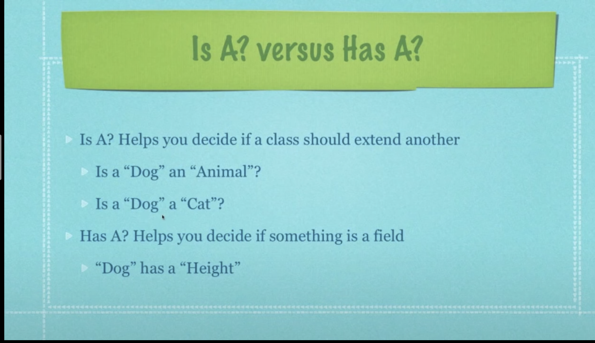
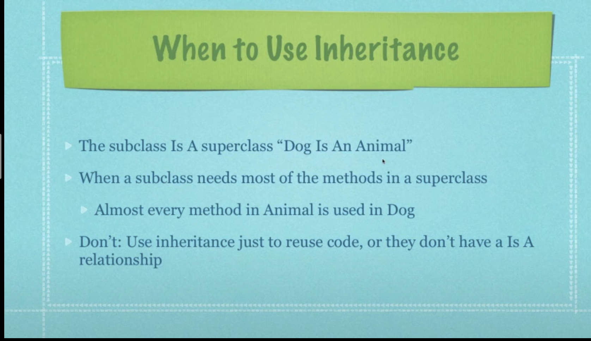
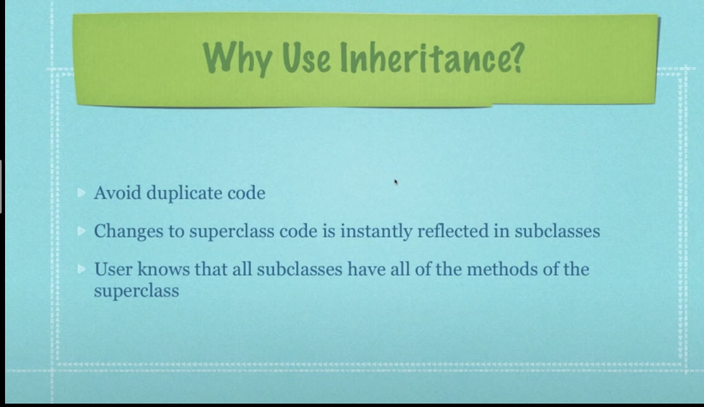

# Table of Contents
-  [Encapsulation](#encapsulation-its-protect-our-data)
- [Inheritance](#inheritance)
- [Strategy Pattern](#strategy-pattern)
- [Observer Pattern](#observer-pattern)
- [Abstract Factory Pattern](#abstract-factory-design-pattern)
- [Singleton Pattern](#singleton-pattern)


## Encapsulation: It's protect our data.
```
class Dog{
    String name;
    double height;

    setWeight(int newWeight){
        if(newWeight > 0){
            weight = newWeight;
        }else{
            // Throw an error
        }
    }
}
```

`Instance variable` is created inside the class.

`Local variable` is created inside the methods.

## Inheritance





### We cann't use non-static variable and methods inside static method.

## Strategy Pattern
- In strategy pattern we mainly uses concept of decoupling.
- Where instead of implementing the interface we uses composition for adding the functionality.
- Not implementing interface because then all classes should have to implement it even they are not using it.

## Observer Pattern
**Subject.java (interface)**
- public void register(Observer o);
- public void unregister(Observer o);
- public notifyAll();

**Observer.java (interface)**
- public update(params...);

Subject will register all the observers and notify them if its internal state changes.

## [Abstract Factory Design Pattern](https://chatgpt.com/share/6766515c-b660-8008-b475-9cce6d44e9f0)
Provide an interface of creating families of related or dependent objects without specifying their concrete classes.

Example: In a company manager knows who can solve the issue. And then he refers to the concerned department.

## [Singleton Pattern](https://chatgpt.com/share/67665514-ca50-8008-b656-bcfa3c00b3c5)
Use for creating a single instance of an object.

Example: Singleton Pattern
```java
public class Singleton {
    private static Singleton instance;

    private Singleton() {}

    public static Singleton getInstance() {
        if (instance == null) {
            instance = new Singleton(); // Lazy initialization
        }
        return instance;
    }
}
```

Thread safe singleton class.
```java
public class Singleton {
    private static volatile Singleton instance;

    private Singleton() {}

    public static Singleton getInstance() {
        if (instance == null) {
            synchronized (Singleton.class) {
                if (instance == null) {
                    instance = new Singleton();
                }
            }
        }
        return instance;
    }
}
```

2
## [Builder Pattern](https://youtu.be/9XnsOpjclUg?si=a0VtB4Tp0aR3KKEm)
- Pattern used to create objects made from a bunch of other objects.
- When you want to build an object made up from other objects.
- When you want the creation of these parts to be independent of the main object.
- Hide the creation of the parts from the client so both aren't dependent.
- The builder knows the specifics and nobody else does.

## [Prototype Pattern](https://youtu.be/AFbZhRL0Uz8?si=Sx-JHwlswc6EYutU)
- Creating new objects (instances) by cloning (copying) other objects.
- Allows for adding of any subclass instance of a known super class at run time.
- When there are numerous potential classes that you want to only use if needed at runtime
- Reduces the need for creating subclasses
