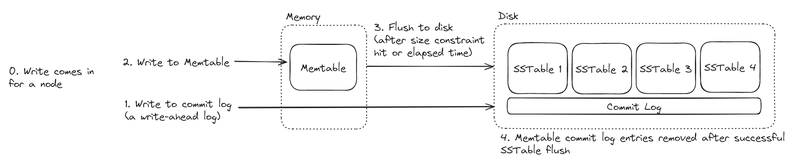
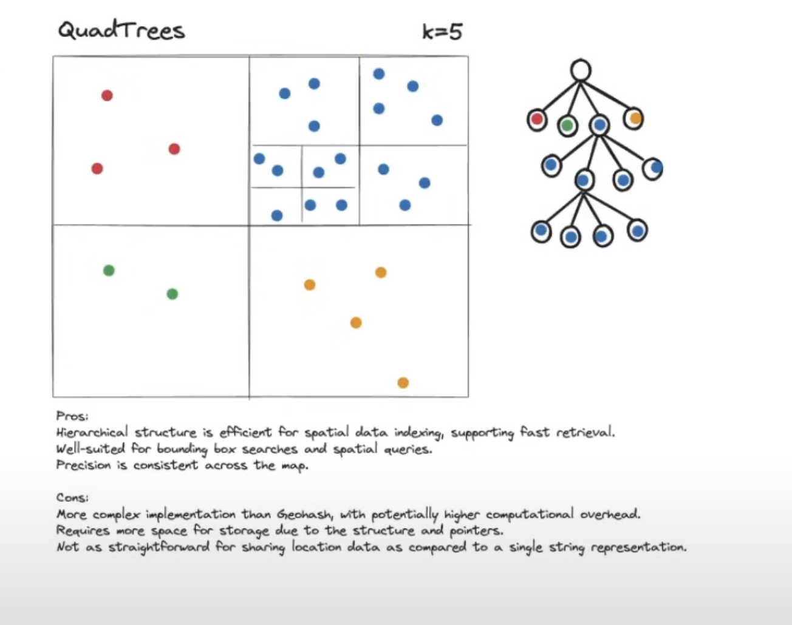
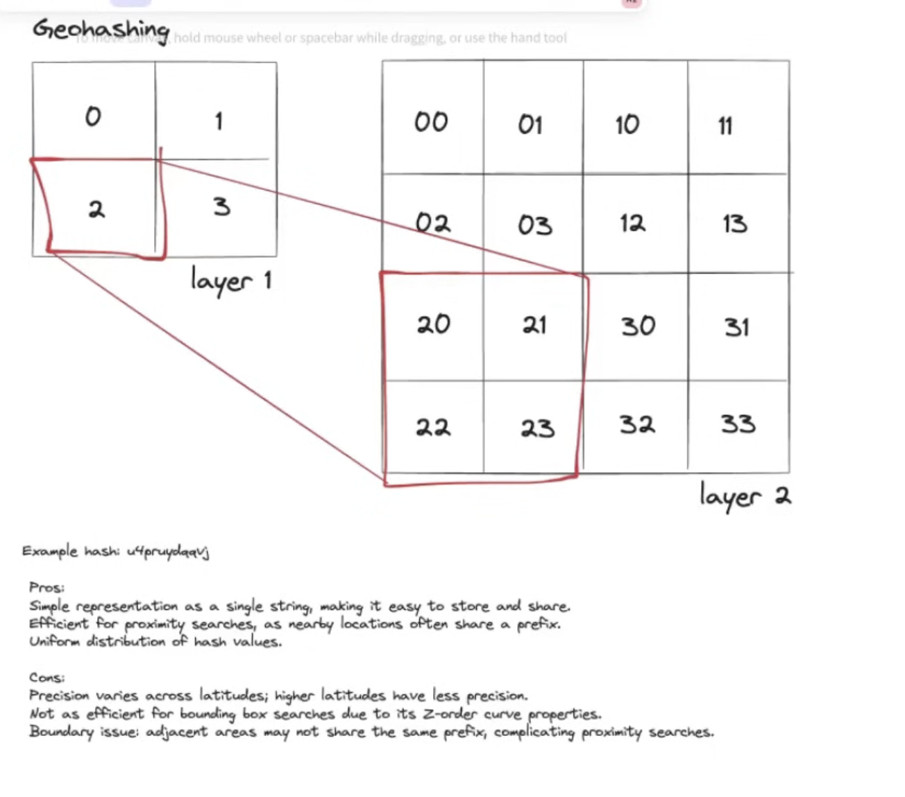

# System Design

## Table of Contents
-   [Important Topics](#important-topics)
    - [CAP Theorem](#cap-theorem)
    - [Consistent Hashing](#consistent-hashing)
    - [Bloom Filter](#bloom-filter)
    - [AWS Opensearch](#aws-opensearch)
    - [Redis](#redis)
    - [Kafka](#kafka)
    - [Cassandra](#cassandra)
    - [DynamoDB](#dynamodb)
    - [PostgreSQL](#postgresql)
    - [Long Polling](#long-polling)
    - [Web Sockets](#web-sockets)
    - [Server Sent Events](#server-sent-events-sse)
    - [Change Data Capture](#change-data-capture)
    - [Elastic Search](#elastic-search)
    - [Choke Point](#stratigies-for-handling-choke-point)
    - [Secondary Indexes in Dynamo DB](#secondary-indexes-in-dynamo-db)
-   [Future Reads](#future-reads)
-   [Delivery Framework](#delivery-framework)
-   [Core Concepts](#core-concepts)
-   [Key Technologies](#key-technologies)
-   [Design Ticket Master](#design-ticket-master)
-   [Design Uber](#design-uber)

Flink/Aws firehouse / Spark streams: Aggregator services 
count min sketch / map reduce 

## Important Topics:

## [CAP Theorem](https://en.wikipedia.org/wiki/CAP_theorem)
**Strong consistency**
- implement distributed transactions
- limit to a single node
- discuss consensus protocols
- accept higher latency
- Example tools
    - PostgreSQL
    - Trad RDBMS
    - Spanner
    - NoSQL with strong consistency mode (DynamoDB)


**Availability**
- use multiple replicas
- CDC and eventual consistency is ok
- Example tools
    - DynamoDB (in multi-AZ mode)
    - Cassandra

#### Different types of consistency
1. Strong Consistency: all reads reflect most recent write
2. Causal Consistency: related events appear in order
3. Read-your-writes Consistency: user sees their own updates
4. Eventual Consistency: updates will propagate eventually

<sub>[back to top](#table-of-contents)</sub>

## [Consistent Hashing](https://www.youtube.com/watch?v=zaRkONvyGr8)
Consistent hashing is a fundamental technique used in distributed systems to partition data / load across machines in a way that prioritizes evenness of distribution while minimizing re-mapping of data if a node enters or leaves the system.

<sub>[back to top](#table-of-contents)</sub>

## [Bloom filter](https://www.youtube.com/watch?v=gBygn3cVP80)
A Bloom filter is a space-efficient probabilistic data structure used to test whether an element is a member of a set. It is designed for scenarios where fast lookups and memory efficiency are crucial, but it allows for a small probability of false positives.

<sub>[back to top](#table-of-contents)</sub>


## AWS Opensearch 
Node query caching from all of the clusters of elastic seach if cache 10k queries in LRU basis.

<sub>[back to top](#table-of-contents)</sub>

## [Redis](https://www.youtube.com/watch?v=fmT5nlEkl3U&list=PL5q3E8eRUieUHnsz0rh0W6AzwdVJBwEK6&index=2&pp=iAQB)
Where to use Redis:
- ⁠basic rate limiting
- ⁠⁠geo spacitial index
- ⁠⁠service registry
- ⁠⁠producer-consumer i.e async job queue

**Redis stream** - order of list of items that given an id which is usually a timestamp this id’s has their own key- value pair.


- Data structures database
- Redis give us power to use data structures in databases.
- Bloomfilter, string, obj might be Redis key  
- Replica of Redis updated every minute.  
- Only way to shard the Redis is to choose the key on which we are going to shard the data.
- Hotkey problem: append random number to the key.
- To scale Redis thought about key space.

<sub>[back to top](#table-of-contents)</sub>

## [Kafka](https://www.youtube.com/watch?v=DU8o-OTeoCc&list=PL5q3E8eRUieUHnsz0rh0W6AzwdVJBwEK6&index=1&pp=iAQB)
Use case: 
- Multiple consumer. ex: Facebook Comments.
- Inorder message processing. ex: Ticketmaster.
- In place of queue. ex: YouTube transcribe.
- Decouple producer and consumer so they can scale independently. ex: Leetcode online judge. 
- Need to process a lot of data in realtime. ex: Ad-click
- Kafka will do the implicit retry at producer side.
- Kafka does not do implicit retry at consumer side we need to do it and put the message in retry queue.

Kafka's architecture is built around a distributed messaging system designed for high throughput, scalability, and fault tolerance. Key components include:

1. **Producers**: Applications that publish (write) messages to Kafka topics.

2. **Topics**: Logical channels where messages are categorized. Each topic is divided into partitions for parallelism.

3. **Partitions**: Each topic has one or more partitions that store data sequentially. Each message within a partition has a unique offset.

4. **Consumers**: Applications that subscribe to topics and read (consume) messages. Consumers are grouped into consumer groups for scalability and fault tolerance.

5. **Brokers**: Kafka servers that store and serve messages. A Kafka cluster consists of multiple brokers.

6. **ZooKeeper (deprecated in newer versions)**: Used for managing cluster metadata, leader election, and configuration management (replaced by Kafka’s internal quorum-based system in newer versions).

7. **Replication**: Ensures fault tolerance by duplicating partitions across brokers. Each partition has one leader and several replicas; the leader handles all reads and writes, while replicas provide redundancy.

8. **Producers and Consumers Coordination**: Kafka handles message delivery guarantees such as "at-most-once," "at-least-once," or "exactly-once" semantics.

This architecture enables Kafka to handle real-time data streams efficiently and reliably.

**Note**:  
On good hardware, a single broker can store around 1TB of data and handle around 10,000 messages per second (this is very hand wavy as it depends on message size and hardware specs, but is a useful estimate)

<sub>[back to top](#table-of-contents)</sub>

## [Cassandra](https://www.hellointerview.com/learn/system-design/deep-dives/cassandra)

**Data Model**  
Keyspaces->Table->Row->Column

**Partition Key** - One or more columns that are used to determine what partition the row is in. We'll discuss partitioning of data later in this deep-dive.  
**Clustering Key** - Zero or more columns that are used to determine the sorted order of rows in a table. Data ordering is important depending on one's data modeling needs, so Cassandra gives users control over this via the clustering keys.

**Partitioning**  
- Uses consistent hashing  

**Replication**
- NetworkTopologyStrategy
- SimpleStrategy.

**Consistency**  
- Cassandra does not support any notions of ACID gurantees.
- It only supports atomic and isolated writes at the row level in partition.
- Cassandra supports different consistency level.
example: one, two, three, quorum, any etc.
- One notable consistency level to understand is QUORUM. QUORUM requires a majority (n/2 + 1) of replicas to respond. Applying QUORUM to both reads and writes guarantees that writes are visible to reads because at least one overlapping node is guaranteed to participate in both a write and a read. 

**Storage Model**
- Cassandra Uses Log Structured Merge (LSM) Tree. The 3 constructs core to the LSM tree index are:
- Commit Log - This basically is a write-ahead-log to ensure durability of writes for Cassandra nodes.
- Memtable - An in-memory, sorted data structure that stores write data. It is sorted by primary key of each row.
- SSTable - A.k.a. "Sorted String Table." Immutable file on disk containing data that was flushed from a previous Memtable.


- When reading data for a particular key, Cassandra reads the Memtable first, which will have the latest data. If the Memtable does not have the data for the key, Cassandra leverages a `bloom filter` to determine which SSTables on disk might have the data. It then reads the SSTables in order from newest to oldest to find the latest data for the row. 

**Falut Tolerance**  
Nodes independently detect failures during gossip, temporarily storing write data as hints for offline nodes to ensure data consistency and recovery when they rejoin the cluster.

**Concurrency Control**
- Using Concurrency Control (`Last Write Win`)
- Lightweight Transactions using Paxos
- Concurrent Write Handling using `Memtable` updates and `commit log`.
- Read-Repair
- consistency level (Quorum, all, one)
- Writes are never overwritten in place. Instead, new data is appended with newer timestamps.
- Old data is compacted and garbage collected during the compaction process.

#### Indexes:

Cassandra provides several types of indexes to support efficient data retrieval and enhance query flexibility. Each type of index is suited for specific use cases, depending on the data model and query requirements.

---

### 1. **Primary Index (Primary Key)**
- **Description**: The primary index is automatically created for the **primary key** of a table, which includes the partition key and clustering columns.
- **Use Case**: It is used to efficiently locate rows by the partition key.
- **Example**:
  ```sql
  CREATE TABLE users (
      user_id UUID PRIMARY KEY,
      name TEXT,
      email TEXT
  );
  ```
  Querying by `user_id` is efficient because it uses the primary index.

---

### 2. **Secondary Index**
- **Description**: A secondary index can be created on a column that is **not part of the primary key** to support additional query patterns.
- **Use Case**: Used for queries that do not include the partition key, but it has limitations, such as performance issues on large datasets.
- **Syntax**:
  ```sql
  CREATE INDEX email_index ON users (email);
  ```
- **Query Example**:
  ```sql
  SELECT * FROM users WHERE email = 'john@example.com';
  ```

#### Limitations of Secondary Indexes:
- Not efficient for high-cardinality columns (columns with many unique values).
- Best suited for low-cardinality or moderately distributed values.
- Performance can degrade with large datasets or frequent updates.

---

### 3. **Materialized Views**
- **Description**: A materialized view creates a new table with an alternate primary key, derived from the base table, allowing additional query patterns.
- **Use Case**: Used to precompute and store results for alternate queries, effectively supporting multiple query patterns without duplicating data.
- **Syntax**:
  ```sql
  CREATE MATERIALIZED VIEW user_by_email AS
  SELECT user_id, name, email
  FROM users
  WHERE email IS NOT NULL
  PRIMARY KEY (email, user_id);
  ```
- **Query Example**:
  ```sql
  SELECT * FROM user_by_email WHERE email = 'john@example.com';
  ```

#### Limitations of Materialized Views:
- Requires additional storage and computational resources.
- Updates to the base table propagate to the view asynchronously, so it may have eventual consistency.

---

### 4. **SASI (SSTable Attached Secondary Index)**
- **Description**: SASI is a more advanced type of secondary index introduced in newer versions of Cassandra. It supports a wider range of queries, including **LIKE** and range queries.
- **Use Case**: Suitable for text search and range queries, providing better performance than traditional secondary indexes for specific workloads.
- **Syntax**:
  ```sql
  CREATE CUSTOM INDEX sasi_index ON users (name)
  USING 'org.apache.cassandra.index.sasi.SASIIndex'
  WITH OPTIONS = {
      'mode': 'CONTAINS',
      'analyzed': 'true',
      'analyzer_class': 'org.apache.cassandra.index.sasi.analyzer.StandardAnalyzer'
  };
  ```
- **Query Example**:
  ```sql
  SELECT * FROM users WHERE name LIKE '%John%';
  ```

#### Benefits of SASI:
- Supports advanced search functionality like prefix, suffix, and substring matching.
- Efficient for low-cardinality or moderately distributed data.

---

### 5. **Custom Index**
- **Description**: Allows developers to implement their own indexing mechanism by writing custom code.
- **Use Case**: Useful for specialized use cases where built-in indexes do not suffice.
- **Implementation**: Requires extending Cassandra's indexing capabilities programmatically.

---

### Comparison of Indexes
| **Feature**              | **Primary Index** | **Secondary Index** | **Materialized View** | **SASI**           |
|---------------------------|-------------------|----------------------|------------------------|--------------------|
| Created automatically?    | Yes               | No                   | No                     | No                 |
| Use case                 | Partition key     | Non-primary columns  | Alternate primary key  | Full-text search   |
| Supports range queries    | No                | No                   | Yes                    | Yes                |
| Best for high-cardinality | Yes               | No                   | Yes                    | Moderate           |
| Query performance         | Best              | Moderate             | Good                   | Moderate           |

---

### Best Practices for Indexing in Cassandra
1. **Avoid Overusing Secondary Indexes**:
   - Prefer denormalizing your data or creating materialized views for better performance.
2. **Use SASI Sparingly**:
   - Suitable for specific workloads like text search but may introduce performance overhead for large datasets.
3. **Denormalization First**:
   - Cassandra's design favors denormalization and query-driven schema design over relying on indexes.
4. **Leverage Materialized Views**:
   - Use materialized views for alternate query patterns but monitor consistency and resource usage.

By carefully choosing the right type of index, you can optimize query performance and maintain scalability in Cassandra.

<sub>[back to top](#table-of-contents)</sub>

## [DynamoDB](https://www.hellointerview.com/learn/system-design/deep-dives/dynamodb)

**Global Secondary Index (GSI)** - An index with a partition key and optional sort key that differs from the table's partition key. GSIs allow you to query items based on attributes other than the table's partition key.

**Local Secondary Index (LSI)** - An index with the same partition key as the table's primary key but a different sort key. LSIs enable range queries and sorting within a partition, providing an alternative to GSIs when querying items with the same partition key.


When designing global applications in your interview, simply mentioning Global Tables for cross-region replication is often sufficient.


#### [<u>DAX (DynamoDB Accelerator)</u>](https://www.hellointerview.com/learn/system-design/deep-dives/dynamodb#dax-dynamodb-accelerator)
Fun fact, Dynamo comes with a built-in, in-memory cache called DynamoDB Accelerator (DAX). So there may be no need to introduce additional services (Redis, MemchacheD) into your architecture, just enable DAX.   

DAX is a caching service designed to enhance DynamoDB performance by delivering sub-millisecond response times for read-heavy workloads. Being native to DynamoDB, DAX requires no changes to application code; it simply needs to be enabled on your tables.  

It operates as both a read-through and write-through cache, which means it automatically caches read results from DynamoDB tables and delivers them directly to applications, as well as writes data to both the cache and the underlying DynamoDB table. Cached items are invalidated when the corresponding data in the table is updated or when the cache reaches its size limit. 

#### [<u>Change Data Capture (CDC) through DynamoDB Streams.</u>](https://www.hellointerview.com/learn/system-design/deep-dives/dynamodb#streams)
Dynamo also has built-in support for Change Data Capture (CDC) through DynamoDB Streams. Streams capture changes to items in a table and make them available for processing in real-time. Any change event in a table, such as an insert, update, or delete operation, is recorded in the stream as a stream record to be consumed by downstream applications

Helpful in the following cases:  
-   Consistency with Elasticsearch
-   Real-time Analytics
-   Change Notifications

#### Summary of Concurrency Control in DynamoDB

| **Method**                  | **Use Case**                                                                 | **Key Features**                                                                                  |
|-----------------------------|-----------------------------------------------------------------------------|--------------------------------------------------------------------------------------------------|
| **Optimistic Locking**       | Prevent conflicting updates based on versioning                            | Uses `ConditionExpression` to validate preconditions before writing                              |
| **Atomic Counters**          | Increment or decrement values atomically                                   | Handles high-concurrency updates to numerical attributes                                         |
| **Transactions**             | ACID-compliant, grouped operations                                         | Ensures all-or-nothing execution of multiple operations                                          |
| **Conditional Writes**       | Insert, update, or delete only when specific conditions are met            | Prevents overwrites or duplicate entries                                                        |
| **Last-Write Wins**          | Default conflict resolution when no conditions are specified               | May lead to data overwrites in concurrent scenarios                                              |
| **Streams**                  | Detect and resolve conflicts in near real-time                             | Enables custom conflict resolution logic through stream processing                               |

<sub>[back to top](#table-of-contents)</sub>

## [PostgreSQL](https://www.hellointerview.com/learn/system-design/deep-dives/postgres)
### Read Performance
---

**Basic Indexes**  

Postgres uses B-tree indexes, which work great for:
- Exact matches (WHERE email = 'user@example.com')
- Range queries (WHERE created_at > '2024-01-01')
- Sorting (ORDER BY username if the ORDER BY column match the index columns' order)

**GIN Indexes**

Postgres supports `full-text search` out of the box using `GIN (Generalized Inverted Index)` indexes.

For many applications, this built-in search capability means you don't need a separate Elasticsearch cluster. It supports everything from:
- Word stemming (finding/find/finds all match)
- Relevance ranking
- Multiple languages
- Complex queries with AND/OR/NOT

While PostgreSQL's full-text search is powerful, it may not fully replace Elasticsearch for all use cases. Consider Elasticsearch when you need:
- More sophisticated relevancy scoring
- Faceted search capabilities
- Fuzzy matching and "search as you type" features
- Real-time index updates
- Distributed search across very large datasets
- Advanced analytics and aggregations
- JSONB columns with GIN indexes are particularly useful when you need flexible metadata

**PostGIS**  

Geospatial Search with PostGIS. While not built into PostgreSQL core, the PostGIS extension adds powerful spatial capabilities.  
PostGIS is incredibly powerful - it can handle:
- Different types of spatial data (points, lines, polygons)
- Various distance calculations (as-the-crow-flies, driving distance)
- Spatial operations (intersections, containment)
- Different coordinate systems  

**Covering indexes**  

Covering indexes can make queries significantly faster because PostgreSQL can satisfy the entire query just from the index without touching the table. The trade-off is that the index takes up more space and writes become slightly slower.

**Partial indexes** 

Partial indexes are particularly effective in scenarios where most of your queries only need a subset of rows, when you have many "inactive" or "deleted" records that don't need to be indexed, or when you want to reduce the overall size and maintenance overhead of your indexes. 

### Write Performance
- Transaction log(WAL) Write(Disk)
- Buffer Cache Update(Memory)
- Background Writer[Memory -> Disk]
- Index update[Memory & Disk]

### Write Performance Optimizations
- Vertical Scaling
- Batch Processing
- Table Partitioning
- Sharding

### Practical Performance Limit
***Query Performance:***
- Simple indexed lookups: thousands per second per core
- Complex joins: hundreds per second
- Full-table scans: depends heavily on whether data fits in memory

***Scale Limits:***
- Tables start getting unwieldy past 100M rows
- Full-text search works well up to tens of millions of documents
- Complex joins become challenging with tables >10M rows
- Performance drops significantly when working set exceeds available RAM

***Throughput Limitations***

A well-tuned PostgreSQL instance on good (not great) hardware can handle:
- Simple inserts: ~5,000 per second per core
- Updates with index modifications: ~1,000-2,000 per second per core
- Complex transactions (multiple tables/indexes): Hundreds per second
- Bulk operations: Tens of thousands of rows per second

### Difference between Sharding and Table Partitioning

| **Feature**           | **Sharding**                                   | **Table Partitioning**                        |
|------------------------|-----------------------------------------------|-----------------------------------------------|
| **Scope**             | Across multiple servers/databases             | Within a single database instance             |
| **Granularity**       | Database-level or application-level            | Table-level                                   |
| **Scalability**       | Horizontal scaling (add more servers)          | Vertical scaling (optimize within one server) |
| **Management**        | Requires external logic to coordinate shards  | Managed within the database system            |
| **Implementation**    | Separate databases per shard, distributed via shard key | Single table split into partitions based on partition key |
| **Performance**       | Distributes traffic and storage across servers | Improves query performance within a single database |
| **Fault Tolerance**   | High: Failure of one shard doesn't impact others | Limited: Depends on the single server's availability |
| **Complexity**        | High: Requires application-level changes       | Moderate: Requires careful partitioning strategy |
| **Use Case**          | Massive datasets or high traffic distributed across servers | Optimizing performance of large tables in a single database |
| **Example Key**       | Shard key (e.g., user ID, region)              | Partition key (e.g., date range, category)    |


### Replication

Replication - async, sync
- Scale Reads: By creating read replica.
- High Availability: Replication is not only for scaling it also brings reliability.


### Row level locking Vs Serializable isolation


| **Aspect**               | **Serializable Isolation**                                 | **Row-Level Locking**                                      |
|--------------------------|------------------------------------------------------------|------------------------------------------------------------|
| **Concurrency**           | Lower - transactions might need to retry on conflict       | Higher - only conflicts when touching the same rows        |
| **Performance**           | More overhead - must track all read/write dependencies     | Less overhead - only locks specific rows                   |
| **Use Case**              | Complex transactions where it's hard to know what to lock | When you know exactly which rows need atomic updates       |
| **Complexity**            | Simple to implement but requires retry logic               | More explicit in code but no retries needed                |
| **Error Handling**        | Must handle serialization failures                         | Must handle deadlock scenarios                             |
| **Example**               | Complex financial calculations across multiple tables      | Auction bidding, inventory updates                        |
| **Memory Usage**          | Higher - tracks entire transaction history                 | Lower - only tracks locks                                  |
| **Scalability**           | Doesn’t scale as well with concurrent transactions         | Scales better when conflicts are rare                      |


### Isolation levels in PostgreSQL

| **Isolation Level**   | **Dirty Reads** | **Non-Repeatable Reads** | **Phantom Reads** | **Description**                                                       | **Use Case**                              |
|-----------------------|-----------------|--------------------------|-------------------|-----------------------------------------------------------------------|-------------------------------------------|
| **Read Uncommitted**   | Allowed         | Allowed                  | Allowed           | Transactions can read uncommitted data (dirty reads). PostgreSQL treats it like Read Committed. | Rarely used, similar to **Read Committed** in PostgreSQL. |
| **Read Committed**     | Not Allowed     | Allowed                  | Allowed           | Each query sees committed data, but subsequent queries may see different data (non-repeatable reads). | **Default in PostgreSQL**. Suitable for general-purpose applications with less stringent consistency requirements. |
| **Repeatable Read**    | Not Allowed     | Not Allowed              | Allowed           | Guarantees that all queries within the transaction will see the same data. Prevents non-repeatable reads but allows phantom reads. | Suitable for applications requiring consistency across multiple queries, such as reporting. |
| **Serializable**       | Not Allowed     | Not Allowed              | Not Allowed       | The highest level of isolation; transactions execute as if serial, preventing dirty reads, non-repeatable reads, and phantom reads. | Ideal for critical applications like banking or finance that require strict consistency. |

<sub>[back to top](#table-of-contents)</sub>

## Long Polling
Client open a connection which is there for 5-10 minutes. And keep waiting for servers response. Good for scenarios where client is not staying long on the page.

If you need to give your clients near-realtime updates, you'll need a way for the clients to receive updates from the server. Long polling is a great way to do this that blends the simplicity and scalability of HTTP with the realtime updates of Websockets. With long polling, the client makes a request to the server and the server holds the request open until it has new data to send to the client. Once the data is sent, the client makes another request and the process repeats. Notably, you can use standard load balancers and firewalls with long polling - no special infrastructure needed.

<sub>[back to top](#table-of-contents)</sub>

## Web sockets
Bidirectional persistent connection.

<sub>[back to top](#table-of-contents)</sub>

## Server Sent Events (SSE)
SSE is unidirection, only from server to client.

 Server Sent Events (SSE) are a great way to send updates from the server to the client. They're similar to long polling, but they're more efficient for unidirectional communication from the server to the client. SSE allows the server to push updates to the client whenever new data is available, without the client having to make repeated requests as in long polling. This is achieved through a single, long-lived HTTP connection, making it more suitable for scenarios where the server frequently updates data that needs to be sent to the client. Unlike Websockets, SSE is designed specifically for server-to-client communication and does not support client-to-server messaging. This makes SSE simpler to implement and integrate into existing HTTP infrastructure, such as load balancers and firewalls, without the need for special handling.

<sub>[back to top](#table-of-contents)</sub>

## Change Data Capture
- It is a process in which changes to primary data store put onto stream and then those change events can be consumed and something can be done with them.

<sub>[back to top](#table-of-contents)</sub>

## [Elastic Search](https://www.youtube.com/watch?v=PuZvF2EyfBM&list=PL5q3E8eRUieUHnsz0rh0W6AzwdVJBwEK6&index=3)

- For fast search queries, it uses a inverted index.
- Elastic search support point in time search.
-  A search request by default executes against the most recent visible data of the target indices, which is called point in time. Elasticsearch pit (point in time) is a lightweight view into the state of the data as it existed when initiated.
- It is very expensive.  

**Question:** How you can use elastic search in your system design interview?  
**Answer:** For complex search   
- geo sptial.
- vector search.
- full text search.

Notes:
- Not your primary database.  
- Best with read-heavy workloads.   
- Must tolerate eventual consistency. 
- Denormalization is the key. (It faces problems in join. So, not good for things which required join.)  
- Do you even need it.


<sub>[back to top](#table-of-contents)</sub>

## Choke Point
- Using virtual queue.

## [Secondary Indexes in Dynamo DB](https://docs.aws.amazon.com/amazondynamodb/latest/developerguide/SecondaryIndexes.html)
A secondary index is a data structure that contains a subset of attributes from a table, along with an alternate key to support Query operations. You can retrieve data from the index using a Query, in much the same way as you use Query with a table. A table can have multiple secondary indexes, which give your applications access to many different query patterns.

<sub>[back to top](#table-of-contents)</sub>


## Future Reads:
https://www.hellointerview.com/blog/mastering-estimation
-   
-   API Gateway  
-   SSL Termination  
-   Authentication  
-   Load balancing  
-   Routing   
-   Rate Limiting  
-   Notification Service(Apple push notification, google android firebase)  
-   B-Trees: (It is optimised for single dimension data queries not a two dimensional data queries). As we required to search for driver on the basis of it's [lat, long] position so SQL DB's are not good choice because they internally uses B-Tree.
- Geospatial Index, Quadtree, [PostGIS](https://postgis.net/) 

    -   Good when it is unevenly distribution of density.
    -   Fewer updates because we do not want to reindex the tree every time. 

- Redis GeoHashing
    
    - Good for high number of writes.
    - less good for unevenly distribution.
-  Fan-out
- gRPC (Google Remote Procedure Call)
- Message Broker

<sub>[back to top](#table-of-contents)</sub>

## [Delivery Framework](https://www.hellointerview.com/learn/system-design/in-a-hurry/delivery)
-   Requirements (~ 5 mins)
    -   Functional Requirements
    -   Non-Functional Requirements
    -   Capacity Estimation
-   Core Entities (~ 2 mins)
-   API or System Interface (~5 minutes)
-   [Optional] Data Flow (~5 minutes)  
-   High Level Design (~10-15 minutes)
-   Deep Dives (~10 minutes)

<sub>[back to top](#table-of-contents)</sub>

## [Core Concepts](https://www.hellointerview.com/learn/system-design/in-a-hurry/core-concepts)
-   Scaling [Horizontal / Vertical]
-   Work Distribution [Load Balancer]
-   Data Distribution [Sharding]
-   Consistency [Strong / Week / Eventual]
-   Locking [Granularity / Duration / Can we bypass]
-   Indexing [Primary / Secondary / Specialized]
-   Communication Protocols [Internal - HTTP(s), gRPC / External - HTTP(S), SSE or long polling, and Websockets]

<sub>[back to top](#table-of-contents)</sub>

## Key Technologies
- Core Database (DynamoDB, MongoDB)
    - Relational Databases
    - NoSQL Databases
- Blob Storage (Amazon S3, Google Cloud Storage)
- Search Optimized Database (Elasticsearch)
- API Gateway (AWS API Gateway, Kong and Apigee.)
- Load Balancer (AWS Elastic Load Balancer, NGINX and HAProxy)
- Queue (Kafka and SQS) 
- Streams / Event Sourcing (Kafka and Kinesis)
- Distributed Lock (Redis or Zookeeper)
- Distributed Cache (Redis and Memcached)
- CDN (Cloudflare, Akamai and Amazon CloudFront)

<sub>[back to top](#table-of-contents)</sub>

## Design Ticket Master

Hello Interview 
-   [Article](https://www.hellointerview.com/learn/system-design/answer-keys/ticketmaster) 
-   [Video](https://www.youtube.com/watch?v=fhdPyoO6aXI&list=PL5q3E8eRUieWtYLmRU3z94-vGRcwKr9tM)
-   [Excalidraw](https://app.excalidraw.com/l/56zGeHiLyKZ/2Z8PSPHfA8q)

<sub>[back to top](#table-of-contents)</sub>


## Design Uber
-   [Article](https://www.hellointerview.com/learn/system-design/answer-keys/uber)
-   [Video](https://www.youtube.com/watch?v=lsKU38RKQSo&list=PL5q3E8eRUieWtYLmRU3z94-vGRcwKr9tM&index=2&ab_channel=HelloInterview-SWEInterviewPreparation)
-   [Excalidraw](https://app.excalidraw.com/l/56zGeHiLyKZ/6WXHvJ2vXSd)


### Location DB (For Driver's Location)
-   As we required to search for driver on the basis of it's [lat, long] position so SQL DB's are not good choice because they internally uses B-Tree.

<sub>[back to top](#table-of-contents)</sub>

## Design Dropbox
Pattern Trust but Verify: Instead of trusting on client that it is always sending a correct data do check as much as possible.

